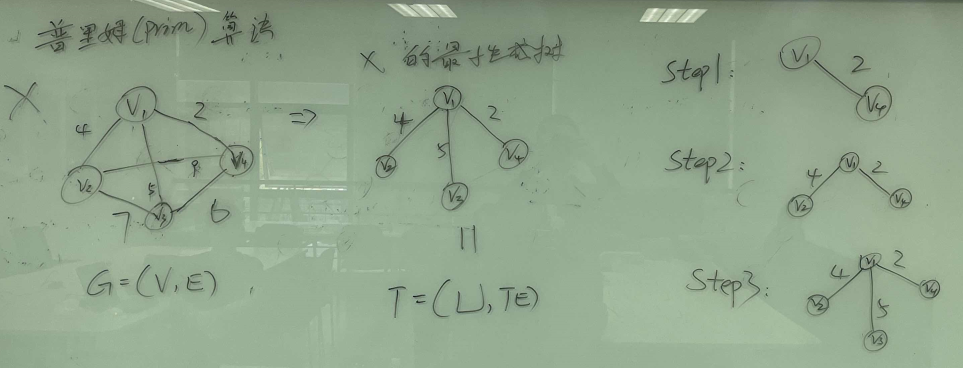
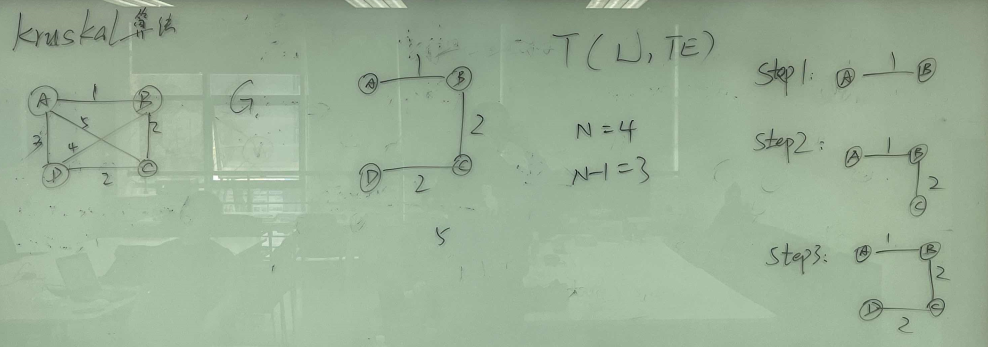

# C++

### 最小生成树

​		最短路径且没有生成回路

### Prim算法

​		（用于解决最小生成树问题的贪心算法）

###### 		基本思想：

​		从图中任意选取一个起点，逐步将与当前生成树相连的边中权值最小的边加入生成树中，直到生成树包含了所有节点。

###### 		核心思想：

​		维护一个集合 S，表示已经加入最小生成树的节点，以及一个集合 V-S，表示还没有加入最小生成树的节点。初始时 S 只包含起点，然后每次从 V-S 中选择一个与 S 中节点距离最小的节点加入 S，直到 V-S 为空集。



###### 举例：

​		假设图用邻接矩阵表示，n 表示节点的数量，cost[i][j] 表示节点 i 和节点 j 之间的边权重，INF 表示正无穷。

以下是 Prim 算法的 C++ 实现。假设图用邻接矩阵表示，n 表示节点的数量，cost[i][j] 表示节点 i 和节点 j 之间的边权重，INF 表示正无穷。

```c++
const int INF = 0x3f3f3f3f;

int prim(int n, vector<vector<int>>& cost) {
    vector<int> dist(n, INF); // 用于记录当前节点到最小生成树的最短距离
    vector<bool> vis(n, false); // 用于记录节点是否已经加入最小生成树
    int ans = 0; // 用于记录最小生成树的权重和
    dist[0] = 0; // 从节点0开始
    for (int i = 0; i < n; i++) {
        int u = -1;
        for (int j = 0; j < n; j++) {
            if (!vis[j] && (u == -1 || dist[j] < dist[u])) {
                u = j;
            }
        }
        vis[u] = true;
        ans += dist[u];
        for (int v = 0; v < n; v++) {
            if (!vis[v] && cost[u][v] < dist[v]) {
                dist[v] = cost[u][v];
            }
        }
    }
    return ans;
}
```


### Kruskai算法

​		（用于解决最小生成树问题的贪心算法）

###### 		基本思想：

​		在保证不形成环的情况下，每次选择一条权值最小的边加入生成树中，直到生成树包含了所有节点。

###### 		核心思想：

​		维护一个集合 S，初始时 S 为空集，然后按照边的权重从小到大排序，依次将每条边加入 S 中，如果加入这条边不会形成环，则加入。



###### 举例：

​		假设图用边集数组表示，n 表示节点的数量，edges[i] 表示第 i 条边，edges[i].u 和 edges[i].v 分别表示边的两个端点，edges[i].w 表示边的权重。

```c++
struct Edge {
    int u, v, w;
    bool operator<(const Edge& other) const {
        return w < other.w;
    }
};

int kruskal(int n, vector<Edge>& edges) {
    vector<int> parent(n);
    for (int i = 0; i < n; i++) {
        parent[i] = i;
    }
    sort(edges.begin(), edges.end()); // 按照边的权重从小到大排序
    int ans = 0;
    for (const auto& edge : edges) {
        int pu = find(edge.u, parent), pv = find(edge.v, parent);
        if (pu != pv) { // 如果加入这条边不会形成环，则加入
            parent[pu] = pv;
            ans += edge.w;
        }
    }
    return ans;
}
```

### forest

### 稀疏矩阵


### 串

#### 	1、BF算法

​		

### 入度和出度

​		在有向图中，每个节点都有一个入度和一个出度。

​		一个节点的**出度**是指从这个节点出发的边的数量，也就是指向其他节点的有向边的数量。

​		一个节点的**入度**是指指向这个节点的边的数量，也就是从其他节点指向该节点的有向边的数量。

​		通俗地说，入度表示有多少条有向边以该节点为终点，出度表示有多少条有向边以该节点为起点。

###### 举例：

## 细微

### 头文件

- `<cstdio>`：提供了文件操作、格式化输入输出等函数，例如 `printf`、`scanf`、`fopen`、`fclose` 等。
- `<cstdlib>`：提供了一些常用的库函数，例如 `malloc`、`calloc`、`free`、`rand` 等。
- `<cstring>`：提供了字符串处理函数，例如 `strcpy`、`strcat`、`strlen`、`strcmp` 等。
- `<cmath>`：提供了数学函数，例如 `sin`、`cos`、`sqrt`、`log`、`pow` 等。
- `<algorithm>`：提供了一些常用算法函数，例如 `sort`、`max`、`min` 等。
- `<vector>`：提供了动态数组容器 `vector`。
- `<string>`：提供了字符串容器 `string`。
- `<map>`：提供了键值对容器 `map`。
- `<set>`：提供了集合容器 `set`。
- `<iostream>`：提供了输入输出流，例如 `cin`、`cout`、`cerr`、`clog` 等。
- `<fstream>`：提供了文件输入输出流，例如 `ifstream`、`ofstream` 等。
- `<ctime>`：提供了日期和时间函数，例如 `time`、`localtime`、`strftime` 等。
- `<cctype>`：提供了字符处理函数，例如 `isalpha`、`isdigit`、`islower`、`toupper` 等。
- `<cstdio>`：提供了格式化输入输出函数，例如 `sprintf`、`fprintf` 等。
- `<stdexcept>`：提供了标准异常类，例如 `out_of_range`、`runtime_error` 等。

### 变量和数据类型

#### 常用变量类型：

###### 		1、整型变量（int）：

​		表示整数类型的变量。

例如：

```C++
int n = 10;
int m = n + 5;


```

###### 		2、长整型变量（long long）：

​		表示长整数类型的变量，通常用于表示较大的整数。

例如：

```c++
long long a = 123456789012345;
long long b = 987654321098765;
long long c = a + b;
```

###### 		3、双精度型变量（double）：

​		表示双精度浮点类型的变量，用于表示小数。

例如：

```C++
double x = 3.1415926;
double y = 2.7182818;
double z = x * y;
```

###### 		4、字符型变量（char）：

​		表示字符类型的变量。

例如：

```c++
char c = 'A';
char d = 'B';
char e = c + d;
```

#### 常用数据类型：

###### 		1、数组（array）：

​		表示一组相同类型的数据，可以通过下标来访问每个元素。

例如：

```c++
int a[5] = {1, 2, 3, 4, 5};
for (int i = 0; i < 5; i++) {
    cout << a[i] << " ";
}
```

###### 		2、字符串（string）：

​		表示一组字符构成的序列，可以进行各种字符串操作。

例如：

```c++
string s1 = "hello";
string s2 = "world";
string s3 = s1 + s2;
cout << s3 << endl;
```

###### 		3、结构体（struct）：

​		表示一组相关的数据类型，可以通过结构体变量来访问其中的成员变量。

例如：

```c++
struct Student {
    string name;
    int age;
    double score;
};
Student stu = {"Tom", 18, 89.5};
cout << stu.name << " " << stu.age << " " << stu.score << endl;
```

###### 		4、指针（pointer）：

​		表示指向某个变量地址的变量，可以进行地址操作和指针操作。

例如：

```c++
int a = 10;
int *p = &a;
cout << *p << endl; // 输出 a 的值
*p = 20; // 修改 a 的值
cout << a << endl; // 输出修改后的 a 的值
```


### 运算符和表达式

###### 		1、算术运算符：

​		包括加、减、乘、除、取模等。

示例代码：

```c++
int a = 3, b = 4;
int c = a + b; // c的值为7
int d = a * b; // d的值为12
int e = b % a; // e的值为1
```

###### 		2、关系运算符：

​		包括小于、大于、等于、不等于、小于等于、大于等于等。

示例代码：

```c++
int a = 3, b = 4;
bool c = a < b; // c的值为true
bool d = a == b; // d的值为false
bool e = b >= a; // e的值为true
```

###### 		3、逻辑运算符：

​		包括与、或、非等。

示例代码：

```c++
bool a = true, b = false;
bool c = a && b; // c的值为false
bool d = a || b; // d的值为true
bool e = !a; // e的值为false
```

###### 		4、位运算符：

​		包括按位与、按位或、按位异或、按位取反等。

示例代码：

```c++
int a = 3, b = 4;
int c = a & b; // c的值为0
int d = a | b; // d的值为7
int e = a ^ b; // e的值为7
int f = ~a; // f的值为-4
```

###### 		5、赋值运算符：

​		包括=、+=、-=、*=、/=、%=等。

示例代码：

```c++
int a = 3, b = 4;
a += b; // a的值变为7
b *= a; // b的值变为28
```

###### 		6、条件运算符：

​		包括? :等。

示例代码：

```c++
int a = 3, b = 4;
int c = a > b ? a : b; // c的值为4
```

###### 		7、其他运算符：

​		包括sizeof、&、*等。

示例代码：

```c++
int a = 3;
int* p = &a; // p指向a的地址
int b = sizeof(int); // b的值为4（int类型的字节数）
```


### 流程控制语句

###### 		1、条件语句 if/else

​		if/else 语句是用于在满足一定条件时执行某些操作的语句。在C++竞赛中，经常需要根据某些条件来执行不同的操作。

​		例如，下面的代码可以判断一个数是否是偶数，并输出相应的结果：

```c++
int num;
cin >> num;
if (num % 2 == 0) {
    cout << "The number is even." << endl;
} else {
    cout << "The number is odd." << endl;
}
```

###### 		2、循环语句 for/while/do-while

​		循环语句是用于重复执行一段代码的语句。在C++竞赛中，常常需要使用循环语句来遍历数组、计算某个数的阶乘、寻找质数等操作。

​		例如，下面的代码可以计算从1到n的所有整数的和：

```c++
int n, sum = 0;
cin >> n;
for (int i = 1; i <= n; i++) {
    sum += i;
}
cout << "The sum of numbers from 1 to " << n << " is " << sum << endl;
```

###### 		3、开关语句 switch

​		开关语句是用于根据不同的情况执行不同操作的语句。在C++竞赛中，经常需要使用开关语句来处理多种情况。

​		例如，下面的代码可以根据输入的数字输出相应的星期几：

```c++
int day;
cin >> day;
switch (day) {
    case 1:
        cout << "Monday" << endl;
        break;
    case 2:
        cout << "Tuesday" << endl;
        break;
    case 3:
        cout << "Wednesday" << endl;
        break;
    case 4:
        cout << "Thursday" << endl;
        break;
    case 5:
        cout << "Friday" << endl;
        break;
    case 6:
        cout << "Saturday" << endl;
        break;
    case 7:
        cout << "Sunday" << endl;
        break;
    default:
        cout << "Invalid input." << endl;
        break;
}
```

###### 		4、跳转语句 break/continue

​		跳转语句是用于在循环或开关语句中跳出或跳过某些语句的语句。在C++竞赛中，经常需要使用跳转语句来提高程序的效率或避免出现错误。

​		例如，下面的代码可以在遇到第一个偶数时跳出循环：

```c++
#include <iostream>
using namespace std;

int main() {
    int arr[] = {1, 3, 2, 4, 5, 6, 7, 8};
    for(int i = 0; i < 8; i++) {
        if(arr[i] % 2 == 0) {
            cout << "First even number found: " << arr[i] << endl;
            break; // 跳出循环
        }
        cout << "Current number is odd: " << arr[i] << endl;
    }
    return 0;
}
```

​		又例如，下面的代码可以跳过所有的偶数，只输出奇数：

```c++
#include <iostream>
using namespace std;

int main() {
    int arr[] = {1, 3, 2, 4, 5, 6, 7, 8};
    for(int i = 0; i < 8; i++) {
        if(arr[i] % 2 == 0) {
            continue; // 跳过当前循环
        }
        cout << "Current number is odd: " << arr[i] << endl;
    }
    return 0;
}
```


### 函数和函数库

###### 		1、vector库 

​		vector库是一个动态数组容器，可以存储任意类型的元素，并且支持动态增删操作。常用的函数包括：

- vector::size()：获取vector的元素个数。
- vector::push_back(val)：在vector末尾添加一个元素val。
- vector::pop_back()：删除vector末尾的一个元素。
- vector::clear()：清空vector中的所有元素。

​		例如，下面的代码使用vector库实现一个动态数组：

```c++
#include <iostream>
#include <vector>
using namespace std;

int main()
{
    vector<int> vec;
    vec.push_back(1);
    vec.push_back(2);
    vec.push_back(3);
    for (int i = 0; i < vec.size(); i++) {
        cout << vec[i] << " ";
    }
    cout << endl;
    vec.pop_back();
    for (int i = 0; i < vec.size(); i++) {
        cout << vec[i] << " ";
    }
    cout << endl;
    vec.clear();
    cout << vec.size() << endl
```

###### 		2、string库 

​		string库包含了许多字符串处理函数，例如字符串的拼接、分割、查找、替换等。常用的函数包括：

- string::size()：求字符串的长度。
- string::substr(pos,len)：截取字符串，从pos位置开始截取len个字符。
- string::find(str,pos)：在字符串中查找str，从pos位置开始查找。
- string::replace(pos,len,str)：将字符串中从pos位置开始的len个字符替换为str。

​		例如，下面的代码使用string库中的substr函数截取一个字符串的一部分：

```c++
#include <iostream>
#include <string>
using namespace std;

int main()
{
    string str = "hello world";
    string sub_str = str.substr(0, 5);
    cout << sub_str << endl;
    return 0;
}
```

###### 		3、vector库 

​		vector库是一个动态数组容器，可以存储任意类型的元素，并且支持动态增删操作。常用的函数包括：

- vector::size()：获取vector的元素个数。
- vector::push_back(val)：在vector末尾添加一个元素val。
- vector::pop_back()：删除vector末尾的一个元素。
- vector::clear()：清空vector中的所有元素。

​		例如，下面的代码使用vector库实现一个动态数组：

```c++
#include <iostream>
#include <vector>
using namespace std;

int main()
{
    vector<int> vec;
    vec.push_back(1);
    vec.push_back(2);
    vec.push_back(3);
    for (int i = 0; i < vec.size(); i++) {
        cout << vec[i] << " ";
    }
    cout << endl;
    vec.pop_back();
    for (int i = 0; i < vec.size(); i++) {
        cout << vec[i] << " ";
    }
    cout << endl;
    vec.clear();
    cout << vec.size() << endl
}
```

###### 		4、algorithm库

​		该函数库中包含了很多算法相关的函数，例如排序、查找等。常用函数包括：

- sort：对数组或容器中的元素进行排序。
- binary_search：在有序数组或容器中查找指定的元素。
- next_permutation：生成下一个排列。

​		例如，下面的代码使用sort函数对数组a进行排序：

```c++
#include <algorithm>
using namespace std;

int a[] = {3, 1, 4, 1, 5, 9, 2, 6, 5, 3, 5};

int main() {
    sort(a, a + 11);
    return 0;
}
```

###### 		5、cmath库

​		该函数库中包含了很多数学相关的函数，例如取整、幂函数等。常用函数包括：

- pow：计算指定数的指定次幂。
- floor：向下取整。
- ceil：向上取整。

​		例如，下面的代码使用pow函数计算2的10次方：

```c++
#include <cmath>
using namespace std;

int main() {
    int x = pow(2, 10);
    return 0;
}
```

###### 		6、queue库

​		该函数库中包含了队列相关的函数和类。常用函数和类包括：

- queue：队列类，实现FIFO数据结构。
- priority_queue：优先队列类，实现可以根据优先级自动排序的FIFO数据结构。

​		例如，下面的代码使用queue类实现队列的基本操作：

```C++
#include <queue>
using namespace std;

queue<int> q;

int main() {
    q.push(1);
    q.push(2);
    q.push(3);
    int x = q.front();
    q.pop();
    return 0;
}
```

###### 		7、stack库

​		该函数库中包含了栈相关的函数和类。常用函数和类包括：

- stack：栈类，实现LIFO数据结构。

​		例如，下面的代码使用stack类实现栈的基本操作：

```C++
#include <stack>
using namespace std;

stack<int> s;

int main() {
    s.push(1);
    s.push(2);
    s.push(3);
    int x = s.top();
    s.pop();
    return 0;
}
```

### 指针和引用

###### 		1、指向数组的指针：

​		常见用法是在遍历数组时使用指针来访问元素，这样可以避免使用数组下标的开销和复杂度。

​		例如，下面的代码计算一个数组的元素和：

```C++
int sum(int* arr, int n) {
    int res = 0;
    for (int i = 0; i < n; i++) {
        res += *(arr + i);
    }
    return res;
}
```

###### 		2、指向结构体的指针：

​		在处理大型数据结构或对象时，使用指针可以减少内存开销和提高程序效率。

​		例如，下面的代码定义了一个结构体表示学生信息，使用指针来处理学生列表：

```C++
struct Student {
    int id;
    string name;
    double score;
};

void printStudentList(Student* students, int n) {
    for (int i = 0; i < n; i++) {
        cout << students[i].id << " " << students[i].name << " " << students[i].score << endl;
    }
}
```

###### 		3、操作指针的运算符：

​		在链表、树等数据结构的操作中，使用指针运算符可以快速定位节点。

​		例如，下面的代码实现了链表的插入操作：

```C++
struct ListNode {
    int val;
    ListNode* next;
    ListNode(int x) : val(x), next(NULL) {}
};

void insert(ListNode* head, int val) {
    ListNode* cur = head;
    while (cur->next != NULL) {
        cur = cur->next;
    }
    cur->next = new ListNode(val);
}
```

###### 		4、操作指针的函数库

​		标准库中的 memcpy 和 memset 函数可以用来操作指针和内存，例如复制数据和清空内存。

​		例如，下面的代码使用 memcpy 函数复制一段内存：

```C++
int arr1[] = {1, 2, 3};
int arr2[3];
memcpy(arr2, arr1, sizeof(arr1));
```

​		此时，arr2 数组中的元素为 1, 2, 3。

### 内存管理和异常处理

##### 		内存管理

​		使用C++编程时，需要手动进行内存的申请和释放，这就是内存管理。内存管理涉及到指针的使用，而指针是一个非常重要的概念，它允许程序在运行时动态地分配和释放内存。

​		

​		1、动态内存分配

​		在程序运行时动态地分配内存，可以使用 new 运算符，

​		例如：

```C++
int* p = new int;
```

​		这行代码会在堆上分配一块大小为 int 的内存，将其地址赋给 p。使用完之后，需要手动释放内存，否则会出现内存泄漏。释放内存可以使用 delete 运算符，

​		例如：

```C++
delete p;
```

​		这行代码会释放 p 所指向的内存块，将其归还给系统。

​		2、动态数组分配

​		动态数组分配和动态内存分配类似，只需要在 new 运算符后面添加方括号，

​		例如：

```C++
int* p = new int[10];
```

​		这行代码会在堆上分配一块大小为 int[10] 的内存，将其地址赋给 p。使用完之后，同样需要手动释放内存，使用 delete[] 运算符，例如：

```C++
delete[] p;
```

​		这行代码会释放 p 所指向的内存块，将其归还给系统。

​		3、智能指针

​		智能指针是一种特殊的指针，它能够自动管理动态分配的内存，避免出现内存泄漏和野指针。常见的智能指针有 ：

- shared_ptr :允许多个指针共享同一个对象，可以使用引用计数来管理内存，当最后一个指向对象的shared_ptr被销毁时，会自动释放所指向的内存。

举例：

```C++
#include <memory>
using namespace std;

int main() {
  shared_ptr<int> p1(new int(42));  // 分配一个int类型的内存空间，并将其值初始化为42
  shared_ptr<int> p2(p1);           // p2和p1指向相同的内存空间，共享所有权
  *p1 = 13;                         // 修改p1所指向的内存空间的值
  cout << *p2 << endl;              // 输出13
  p1.reset();                       // p1释放其所拥有的内存空间，计数器减1
  cout << *p2 << endl;              // 输出13，p2仍然可以访问该内存空间
  p2.reset();                       // p2释放其所拥有的内存空间，计数器减1
  return 0;
}

```

- unique_ptr：独占式智能指针，只允许一个指针指向所管理的对象，当该指针被销毁时，会自动释放所指向的内存。

举例：

```C++
#include <memory>
using namespace std;

int main() {
  unique_ptr<int> p1(new int(42));  // 分配一个int类型的内存空间，并将其值初始化为42
  unique_ptr<int> p2(p1.release()); // p2独占p1所指向的内存空间
  cout << *p2 << endl;              // 输出42
  p2.reset();                       // 释放p2所拥有的内存空间
  return 0;
}

```

- weak_ptr：弱引用智能指针，用于解决shared_ptr的循环引用问题，可以避免循环引用导致的内存泄漏。 

举例：

```C++
#include <memory>
using namespace std;

struct Node;

struct Node {
  shared_ptr<Node> next;
  weak_ptr<Node> prev;
  int data;

  Node(int val) : data(val) {}
};

int main() {
  shared_ptr<Node> head = make_shared<Node>(1);
  shared_ptr<Node> node2 = make_shared<Node>(2);
  shared_ptr<Node> node3 = make_shared<Node>(3);

  head->next = node2;
  node2->next = node3;
  node2->prev = head;
  node3->prev = node2;

  return 0;
}

```

​		4、内存池

​		内存池是一种高效的内存管理技术，它能够减少动态分配和释放内存的次数，提高程序的效率。内存池可以预先分配一块连续的内存，然后将其划分成多个小块，每次使用时从内存池中取出一块，使用完后再将其放回。常见的内存池实现方式有 STL 的 allocator 和 Boost 库中的 pool。

​		举例：管理一块固定大小的内存块，以便在程序运行期间分配和释放内存

```C++
#include <iostream>
#include <vector>

class MemoryPool {
public:
    MemoryPool(size_t block_size, size_t block_count) :
        block_size_(block_size), block_count_(block_count) {
        // 分配内存池所需的空间
        data_ = static_cast<char*>(std::malloc(block_size_ * block_count_));
        // 将内存块添加到空闲链表
        for (size_t i = 0; i < block_count_; ++i) {
            free_blocks_.push_back(data_ + i * block_size_);
        }
    }

    ~MemoryPool() {
        std::free(data_);
    }

    void* Alloc() {
        if (free_blocks_.empty()) {
            return nullptr;
        }
        void* block = free_blocks_.back();
        free_blocks_.pop_back();
        return block;
    }

    void Free(void* block) {
        free_blocks_.push_back(block);
    }

private:
    char* data_; // 内存池数据
    size_t block_size_; // 每个内存块的大小
    size_t block_count_; // 内存块数量
    std::vector<void*> free_blocks_; // 空闲内存块链表
};

```

​		MemoryPool 类是一个简单的内存池实现。它使用 std::malloc 和 std::free 函数分配和释放内存。

​		在构造函数中，它分配了一个固定大小的内存池，并将其分成固定大小的块。它还维护了一个空闲块链表，以便可以轻松地分配和释放内存。

​		在 Alloc 函数中，它从空闲块链表中取出一个块，并将其返回。在 Free 函数中，它将内存块添加到空闲块链表中，以便在以后可以重新使用。

