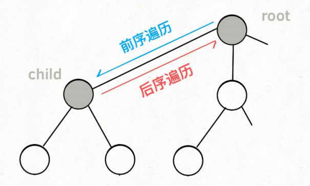

## `isdigit()` 函数

​		 C++ 标准库中的一个函数，用于判断一个字符是否是数字。如果是数字，则返回一个非零值，否则返回零。

```C++
for (char i : e) {
    if (isdigit(i)) {
        num = num * 10 + (i - '0');
    } else {
        if (op == '+') {
            result += num;
        } else {
            result *= num;
        }
        num = 0;
        op = i;
    }
}

```

​		在此代码中，`isdigit(i)` 函数用于判断字符变量 `i` 是否是数字字符，如果是数字字符，则将它与之前读取的数字字符组成一个多位数字。例如，当读取到字符 `'1'` 时，首先将 `num` 初始化为 0，然后将字符 `'1'` 转换成数字 1，并将其加到 `num` 中。接下来读取到字符 `'2'` 时，将 `num` 乘以 10 并加上 2，这样就将字符 `'1'` 和字符 `'2'` 组成了数字 12。这样可以将多位数字转换成整数，便于后续的计算。

## 二叉树

​		基本框架

```C++
void traverse(TreeNode root) {
// 前序遍历
traverse(root.left)
// 中序遍历
traverse(root.right)
// 后序遍历
}
```

## 动态规划

​		**核心问题****：穷举（存在重叠子问题）		**一般形式**：求最值

​		**核心思想**：将原问题分解为子问题，通过保存已解决的子问题的答案来避免重复计算。

​		一定具备 **[最优子结构]**、**[重叠子问题]**						关键点：**状态转移方程**

**步骤：**

1. 确定子问题：将原问题分解为子问题。
2. 确定状态：定义状态表示子问题的解。
3. 确定状态转移方程：确定如何通过已知的子问题的解来计算更大规模的子问题的解。
4. 确定初始条件：确定最小规模子问题的解。
5. 通过状态转移方程递推求解：从最小规模子问题开始，通过递推计算更大规模的子问题的解，直到解决原问题。

**方法：**

1. 暴力递归
2. 数组/哈希表 递归
3. DP数组迭代

判断用不用 DP需满足的性质

1. 最优化原理(最优子结构) ——子问题最优解
2. 无后向性(无后效性)——仅依赖当前状态
3. 重叠子问题——子问题非独立，一个子问题在下面的阶段可能被多次用到

## 递推

​		关系式：
$$
f(n)=F[f(n-1),f(n-2)...f(n-x)]
$$
**步骤：**

1. ​		确定地推变量
2. ​		建立递推关系
3. ​		确定边界条件
4. ​		控制递推过程


## 递归

​		过程函数在过程中直接调用

​		思路：

- ​		将大问题细分为n个小问题
- ​		找到可直接求解的最小子问题（**递归的终止条件**）

​		要素：

​		递归关系式（既原问题如何分解为子问题）：


## 回溯

​		决策树的遍历过程（纯暴力穷举）

1. **路径**：已做出的选择。
2. **选择列表**：当前可以做的选择。
3. **结束条件**：到达决策树底层，⽆法再做选择。

**框架：**

```C++
result = []
def backtrack(路径, 选择列表):
	if 满⾜结束条件:
		result.add(路径)
		return
            
	for 选择 in 选择列表:
		//做选择
		//将该选择从选择列表移除
        路径.add（选择）
		backtrack(路径, 选择列表)
		//撤销选择
        路径.remove（选择）
        //将该选择再加入选择列表
```

**核心：**for循环的递归，递归调用之前做选择，递归调用之后撤销选择。

**多叉树遍历框架：**

```C++
void traverse(TreeNode root) {
	for (TreeNode child : root.childern)
	// 前序遍历需要的操作
	traverse(child);
	// 后序遍历需要的操作
}
```



## 枚举（Enum：enumerate）

​		给定条件内的所有情况一一列举 	——>	通过多次循环实现

**设计思路：**

1. ​		找出枚举范围：分析问题涉及的各种情况
2. ​		找出约束推荐：分析解出问题需要满足的推荐，写成关系表达式

**应用：**

- 冒泡、选择、插入


## 背包

### 分组背包

分组背包问题可以看成是多个 01 背包问题的组合，对于每个组，我们可以使用 01 背包算法来求解，每组的物品都会被当作同一种物品对待，这样就可以避免同一组内的物品被重复选择的问题。
$$
f_{i,j}=\operatorname*{max}_{0\leq k\leq w_{i}}\{f_{i-1,j-k w_{i,1}}+\sum_{j=1}^{n_{i}}[k=c_{i,j}]v_{i,j}\}
$$

### 01背包

**状态转移方程：**
$$
f[i][j] = max(f[i - 1][j], f[i - 1][j - w[i]] + v[j])
$$
​		i : 对i件物体做决策，选择	（放入背包 or 不放入背包）

​		j : 当前背包剩余的容量

