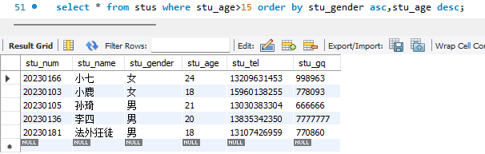

## 一、MySQL逻辑结构

> MySQL可以存储数据，但是存储在MySQL中的数据需要按照特定的结果进行存储

### 1.1 逻辑结构


### 1.2 记录/元组


## 二、 SQL

### 2.1 SQL概述

> SQL(Structured Query Language)
>
> 结构化查询语言，用于存取、查询、更新数据以及管理关系型数据库系统

##### 2.1.1 SQL发展

* SQL是在1981年由IBM公司推出，推出后，基于其简洁的语法在数据库中得到了广泛的应用，成为主流数据库的通用规范
* SQL由ANSI组织确定规范
* 在不同的数据库产品中遵守SQL的通用规范，但也对SQL有一些不同的改进，形成一些数据库的专有指令
  * MySQL：limit
  * SQLServer：top
  * Oracle：rownum

##### 2.1.2 SQL分类

> 根据SQL指令完成的数据库操作的不同，可以将SQL指令分为四类:

* **DDL (Data Definition Language) 数据定义语言**
  * 用于完成对数据库对象（数据库、数据表、视图、索引等）的创建、删除、修改
* **DML (Data Manipulation Language) 数据操作/操纵语言**
  * 用于完成对数据表中的数据的添加、删除、修改操作
  * 添加：将数据存储到数据表
  * 删除：将数据从数据表移除
  * 修改：对数据表中的数据进行修改
* **DQL (Data Query Language) 数据查询语言**
  * 用于将数据表中的放据查询出来
* **DCL (Data Control Language) 数据控制语言**
  * 用于完成事务管理等控制性操作

### 2.2 SQL基本语法

> 在MySQL Command Line Client或者navicat等工具中都可以编写SQL指令

* SQL指令不区分大小写
* 每条SQL指今都以 **;** 结束
* SQL关键字之间以<font color='red'>空格</font>进行分割
* SQL指令之间不限制换行（可空格即可换行）

### 2.3 DDL

##### 2.3.1 DDL 数据库的操作

> 使用DDL语句可对数据库执行创建、查询、修改、删除等操作

**创建**

```sql
##创建封据库
create database <dbName>;

##创建数据库，当指定名称的数据库不存在时执行创建
create database if not exists <dbName>;

#创建数据库的同时指定数据库的字符集，即数据存储在数据库中采用的编码格式(utf-8、gbk等)
create database <dbName> character set utf8;
```

**查询**

```sql
##查询数据库
show databases;

##显示指定名称数据库的创建时的SQL指令
show create database <dbName>;
```

**修改**	修改数据库字符集

```sql
##修改数据库的字符集
alter database <dbName> character set utf8; #utf8 gbk
```

**删除**

```sql
##删除数据库
drop database <dbName>;

##若数据库存在则删除数据库
drop database is exists <dbName>;
```

**使用/切换数据库**

```sql
use <dbName>
```

##### 2.3.2 DDL数据表操作

**创建**

> 数据表实际就是一个二维的表格，一个表格是由多个列组成，表格中的每一类称之为表格的一个字段


```sql
create table students(
	stu_num char(8)not null unique,	#unique：约束条件，禁止出现重复字段
	stu_name varchar(20)not null,
	stu_gender char(2)not null,
	stu_age int not null,
	stu_tel char(11)not null unique,
	stu_qq varchar(11)unique
);
```


**查询**

```sql
##查询数据表
show tables;

##查询表结构
desc <tableName>;
```

**删除**

```sql
##删除数据表
drop table <tableName>;

##若数据表存在，则删除数据表
drop table if exists <tableName>;
```

**修改**

```sql
##修改数据表名
alter table <stableName> rename to <newTableName>:

##数据表也有字符集的，默认与数据库一致
alter table <tableName> character set utf8;

##添加字段（列）
alter table <tableName> add <columnName>varchar(200);

##修改字段的列表和类型
alter table <tableName> change <oldColumnName> <newCloumnName> <type>:

##只修改列（字设）类型
alter table <tableName> modify <columnName> <newType>;

#删除列〔字段）
alter table <tableName> drop <columnName>;
```

### 2.4 MySQL数据类型

> 数据类型，即数据表中的字段所支持存放的数据的类型

##### 2.4.1 数值类型

> 在MySQL中有多种参数据类型可以存放数值，不同类型存放的数值范围和形式不同

|                 类型                 |  内存空间大小  |                      范围                      |                        说明                        |
| :----------------------------------: | :------------: | :--------------------------------------------: | :------------------------------------------------: |
|               tinyint                |     1byte      |    有符号：-128 ~ 127<br />无符号：0 ~ 255     |                 特小型整数（年龄）                 |
|               smallint               | 2byte（16bit） |  有符号：-3278 ~ 3277<br />无符号：0 ~ 65535   |                      小型整数                      |
|              mediumint               |     3byte      | 有符号：-2^31 ~ 2^31-1<br />无符号：0 ~ 2^32-1 |                      中型整数                      |
| <font color='red'>int/integer</font> |     4byte      |                                                |                        整数                        |
|                bigint                |     8byte      |                                                |                      大型整数                      |
|                float                 |     4byte      |                                                |                       单精度                       |
|                double                |     8byte      |                                                |                       双精度                       |
|               decimat                |   第一参数+2   |                                                | decimal（10, 2）<br />表示数值共十位，小数位占俩位 |

##### 2.4.2 字符串类型

> 存储字符序列的类型

|               类型                | 字符序列的长度范围 | 说明                                                         |
| :-------------------------------: | :----------------: | :----------------------------------------------------------- |
|   <font color='red'>char</font>   |    0 ~ 255字节     | 定长字符串，最多可储存255个字符；当指定数据表字段为char(n)时，此列数据最长为n个字符，若添加的数据 < n,则补 ‘\u0000’ 至n长度 |
| <font color='red'>varchar</font>  |     0 ~ 65536      | 可变长度字符串，此类型的类最大长度为65535                    |
|               blob                |     0 ~ 65535      | 存储二进制字符串                                             |
|             tinyblob              |    0 ~ 255字节     | 存储二进制字符串                                             |
|            mediumblob             |    0 ~ 1677215     | 存储二进制字符串                                             |
|             longblob              |   0 ~ 4294967295   | 存储二进制字符串                                             |
|               text                |     0 ~ 65535      | 文本数据（字符串）                                           |
|             tinytext              |    0 ~ 255字节     | 文本数据（字符串）                                           |
|            mediumtext             |    0 ~ 1677215     | 文本数据（字符串）                                           |
| <font color='red'>longtext</font> |   0 ~ 4294967295   | 文本数据（字符串）                                           |

##### 2.4.3 日期类型

> 在MySQL数据库中，可以使用字符串存储时间，但是如果我们需要基于时间字段进行查询操作（查询在某个时间段内的数据)就不便于查问实现

| 类型                              | 格式               | 说明                                  |
| --------------------------------- | ------------------ | ------------------------------------- |
| <font color='red'>date</font>     | 2023-08-13         | 日期，只存储年、月、日                |
| time                              | 11:12:13           | 时间，只存储时、分、秒                |
| year                              | 2023               | 年份                                  |
| <font color='red'>datetime</font> | 2023-08-1311:12:13 | 日期+时间，存储年、月、日、时、分、秒 |
| timestamp                         | 20230813111213     | 日期+时间（时间戳）                   |

### 2.5 字段约束

##### 2.5.1 约束介绍

> 在创建数据表的时候，指定的对数据表的列的数据限制性的装求（对表的列中的数据进行限制）

为什么要给表中的列添加约束呢？

* 保证数据的有效性
* 保证数据的完整性
* 保证数据的正确性

字段常见的约束有：

* 非空约束(not null)：限制此列的值必须提供，不能为空
* 唯一约束(unique)：在表中的多条数据，此列的值不能主复
* 主键约束(primary key)：非空+唯一，能够唯一标识数据表中的一条数据
* 外键约束(foreign key)：建立不同表之间的关联关系

##### 2.5.2 非空约束

> 限制数据表中次列的值必须提供，不能为空

- 创建表，设置图书表的book_name not null

```sql
create table books(
    bookisbn char(4),
    book_name varchar(10) not null.
    book_author varchar(6)
)；
```

- 添加数据


##### 2.5.3 唯一约束

> 在表中的多条数据，此列的值不能重复

* 创建表：设置图书表的book_isbn为unique

```sql
create table books(
    book_isbn char(4)unique,
    book_name varchar(10)not null,
    book_author varchar(6)
);
```

* 添加数据


##### 2.5.4 主键约束

> 主键——数据表中记录的唯一标识，一张表至多存在一个主键（主键可为一个字段，也可为多个字段的组合）
>
> 当一个字段声明为主键后，添加数据时：
>
> * 此字段数据不能为null
> * 此字段数据不能重复

创建表时定义主键

```sql
create table books(
    book_isbn char(4)primary key,
    book_name varchar(10)not null,
    book author varchar(6)
);
```

or

```sql
create table books(
    book_isbn char(4),
    book_name varchar(10)not null,
    book_author varchar(6),
    primary key(book_isbn)
);
```

删除数据表主键约束

```sql
alter table books drop primary key;
```

创建表后添加主键约束

```sql
##创建表时没有添加主键钓束
create table books(
    book_isbn char(4),
    book_name varchar(10) not null,
    book_author varchar(6)
):
##创建表之后添加主键约束
alter table books modify book_isbn char(4) primary key;
```

##### 2.5.5 主键自动增长

> 创建数据表时，若数据表中有列可作为主键，可直接以此列为主键；
>
> 当有些数据表中没有何时的列作为主键时，可以额外定义一个与数据本身并无联系的数据列作为主键，此列作与原数据并无联系，仅用于标识一条记录，在mysql中可将此列定义为int，同时设置为<font color='red'>自动增长</font>、当在数据表中新增一条记录时，该列会自动生成值

定义主键自动增长

* 定义int类型字段自动增长

```sql
create table types(
    type_id int primary key auto_increment,
    type_name varchar(20)not null,
    type_remark varchar(100)
);
```

tips：自动增长从1开始，每增加一条记录，自动增长的列会自动+1，当删除某条数据后再添加数据，自动增长的数据也不会重复生成（自动增长只保证唯一性，不保证连续性）

##### 2.5.6 联合主键

> 联合主键——将数据表中的多列组合在一起设置为表的主键


定义联合主键

```sql
create table grades(
    stu_num char(8),
    course_id int not null,
    score int,
    primary key (stu_num,course_id)
)
```

tips：在实际企业项目的数据库设计中，联合主键使用频率并不高；当一个数据表中没有明确的字段可以作为主键时，我们可以额外添加一个ID字段作为主键

##### 2.5.7 外键约束


### 2.6 DML数据操纵语言

> 用于完成对数据库中数据的插入、删除、修改等操作

```sql
create table students(
    stu_num char(8)primary key,
    stu_name varchar(20)not null,
    stu_gender char(2)not null,
    stu_age int not null,
    stu_tel char(11)not null unique,
    stu_qq varchar(11)unique
);
```


##### 2.6.1 插入数据

**语法**

```sql
insert into <tableName>(columnName,columnName,...) values(value1,value2,...);
```

**eg.**

```sql
##向数据表中指定的列添加数据〔不允许为空的列必须提供数据)
insert into stus(stu_num,stu_name,stu_gender,stu_age,stu_tel)
values('20230181','张三','男',21,'13838383300');
       
##数据表名后的字段名列表顺序可以不与表中一致，但是va1ues中值的顺序必须与表名后字段名顺序对应
insert into stus(stu_num,stu_name,stu_age,stu_tel,stu_gender)
values('20230136','李四',20,'13835342350','女');

##向表中的所有列添加数据时，数据表名后字段列表可以省略，但va1ues中的值的顺序要与数据表定义的字段保持一致
insert into stus values('20230105','孙琦','男',21,'13030383304','666666');

#在项目开发中，若要向所有列添加数据，建议将列名的列表显式写出来（塔强SQL的稳定性）
insert into stus(stu_num,stu_name,stu_gender,stu_age.stu_tel,stu_qq)
values('20230105','孙琦','男',21,'13030303304','666666');
```


##### 2.6.2 删除数据

> 从数据表中删除满足所有特定条件的数据

**语法**

```sql
delete from <tableName> where conditions 
```

**eg.**

```sql
##删除学号为20230102的学生信息
delete from stus where stu_num = '20230102';

##删除年龄大于20岁的学生信息
delete from stus where stu_age > 20;

##若删除语句中没有where，则表示删除该数据表中所有数据
delete from stus;
```


##### 2.6.3 修改数据

> 对数据表中的已有数据进行修改

**语法**

```sql
update <tableName> set columnName = value [where conditions];
```

**eg.**

```sql
##将学号为20230101的学生姓名修改为“法外狂徒”
update stus set stu_name = '法外狂徒' where stu_num = '202230101';

##将学号为20230136的学生性别修改为“男”，QQ修改为“7777777”
update stus set stu_gender = '男',stu_qq = '7777777' where stu_num = '20230136';

##根据主键修改其他所有字段
update stus set stu_name = '法外狂徒',stu_gender = '沃尔玛购物袋',stu_age = '18',stu_tel ='13107426959',stu_gq = '770860' where stu_num = '202230181';

##如果update语句没有where，则表示修改当前表中所有行（记录）
update stus set stu_name = '张三';
```


### 2.7 SQL数据查询语言

> 从数据表中提取满足特定条件的数据
>
> * 单表查询
> * 多表联合查询


##### 2.7.1 基础语法

```sql
##select关键字指定查询的数据字段
select columName1[,columnName2,columnName3,...] from <tableName>;

##若要显示查询到的数据字段，则可以使用 * 代替字段名列表
select * from stus;
```

##### 2.7.2 where子句

> 在删除、修改、查询语句后都可以添加where子句（条件），用于筛选满足特定条件的数据进行删除、修改、查询操作

```sql
delete from <tableName> where condition;

update <tableName> where condition;

select ... where condition;
```

**条件**

```sql
##	=
select * from stus where stu_num = 20230105;

##	!=	<>
select * from stus where stu_num != 20230105;
select * from stus where stu_num <> 20230105;

##	>
select * from stus where stu_age > 18;

##	>=
select * from stus where stu_age >= 20;

##	<=
select * from stus where stu_age <= 20;
```

**多条件查询**

> 在where子句中，可以将多个条件通过逻辑运算符进行连接，通过多个条件筛选有操作的数据

```sql
##	and
select * from stus where stu_gender = '女' and stu_age <= 20;

##	or
select * from stus where stu_gender = '女' or stu_age = 20;

##	not
select * from stus where stu_age not between 18 and 20;
```

##### 2.7.3 LIKE子句

> 在where子句中，可以使用like关键字实现模糊查询

**语法**

```sql
select * from <tableName> where columnName like '...';
```

* 在like关键字后的表达式中
  * %表示任意多个字符 （ %o% 包含字母o）
  * _表示任意一个字符 （ _o% 第二个字母为o）

**eg.**

```sql
#查询学生姓名包合字母o的字生信息
select * from stus where stu_name like '%%';

#查询学生姓名第一个字为“张”的学生信息
select * from stus where stu_name like '张%';

#查询字生姓名最后一个字母为o的学生信息
select * from stus where stu_name like '%o';

#查询学生姓名中第二个字母为o的学生信息
select * from stus where stu_name like '_o%';
```

##### 2.7.4 处理查询结果

**设置查询的字段**

> 声明显示查询结果的指定字段

```sql
select columnName1[,columnName2,columnName3,...] from <tableName> where ...
```

**计算字段**

> 对从数据表中查询的数据的字段进行一定的运算后显示

```sql
##出生年份 = 当前年份 - 年龄
select stu_name,2023-stu_age from stus;
```


**字段别名**

> 为查询结果的字段取一个语义性更强的别名

```sql
select stu_name as 姓名,2023-stu_age as 出生年份 from stus;
```


**清除重复行**

> 从查询的结果中将重复出现的数据清除 <font color='red'>distinct</font>

```sql
select stu_age from stus;
```


```sql
select distinct stu_age from stus;
```


##### 2.7.5 order by 排序

> 将查询到的满足条件的数据按照指定的字段的值 升序 / 降序 排列

**语法**

```sql
select from <tableName> where condition order by columnName asc|desc;
```

* order by columnName 表示将查询结构按照指定的字段排序
  * asc 按照指定的字段升序（默认）
  * desc 按照指定的字段降序排列

**eg.**

```sql
##单字段排序
select * from stus where stu_age>15 order by stu_gender desc;
```


```sql
##多字段排序
select * from stus where stu_age>15 order by stu_gender asc,stu_age desc;
```



##### 2.7.6 聚合函数

> SQL中所提供的可对查询的数据的字段进行计算的函数称之为 **聚合函数**

* <font color='red'>count( )</font> 统计函数

```sql
##统计数据表中学生的总数
select count(stu_num) from stus;
```


```sql
##统计数据表中性别为男的学生的总数
select count(stu_num) from stus where stu_gender = '男';
```


* <font color='red'>max( )</font> 计算最大值

```sql
##查询数据表中年龄最大值
select max(stu_age) from stus;
```


```sql
##查询数据表中性别为女的年龄最大值
select max(stu_age) from stus where stu_gender = '女';
```


* <font color='red'>sum( ) </font>求和

```sql
##计算所有学生的年龄总和
select sum(stu_age) from stus;
```


```sql
##计算所有学生中男生的年龄总和
select sum(stu_age) from stus where stu_gender = '男';
```


* <font color='red'>avg( )</font> 求平均值

```sql
##求学生的年龄平均值
select avg(stu_age) from stus;
```


```sql
##求学生中女生的年龄平均值
select avg(stu_age) from stus where stu_gender = '女';
```


##### 2.7.7 日期函数、字符串函数

**日期函数**

> 向日期类型的列添加数据时，可通过字符串类型赋值（字符串的格式必须为yyyy-MM-dd hh:mm:ss)
> 若想要获取当前系统时间添加到日明类型的字段，可以使用 <font color='red'>now( ) </font>或者 <font color='red'>sysdate( )</font>

**eg.**


```sql
##字符串类型给日期类型的字段赋值
insert into stus(stu_num,stu_name,stu_gender,stu_age,stu_tel,stu_qq,stu_enterence) values('20230109'
,'张小','女',20,'13434343344','123111','2023-09-01 09:00:00');

##通过日期函数now()获得当前日期时间
insert into stus(stu_num,stu_name,stu_gender,stu_age,stu_tel,stu_gq,stu_enterence) values('20230119'
,'陈是','男',19,'13443634344','128641',now());

##通过日期函数sysdate()获得当前日期时间
insert into stus(stu_num,stu_name,stu_gender,stu_age,stu_tel,stu_qq,stu_enterence) values('20230127'
,'洪识','女',18,'13436324316','124626',sysdate());
```

字符串函数

> 通过SQL指令对字符串进行处理

```sql
##	concat
select concat(stu_num,'-',stu_gender) from stus;
```


```sql
##	upper（column）将字段的值转换成大写
select upper(stu_name) from stus;
```


```sql
##	lower(column)将字段的值转换成小写
select lower(stu_name) from stus;
```


```sql
##	substring(column,start,len)
select stu_name,substring(stu_tel,8,4) from stus;
```


##### 2.7.8 分组查询

> 将数据表中的记录按照指定的类进行分组

**语法**

```sql
select 分组字段/聚合函数 
from 表名 
[where 条件] 
group by 分组列名 [having 条件] 
[order by 排序字段]
```

* select 后使用 * 显示对查询结果进行分组后，显示每组的第一条记录（通常无意义）
* select 后通常显示分组字段和聚合函数（对分组后的数据进行统计、求和、求均值等）
* 语句执行属性：
  * 先根据where条件从数据库中查询数据
  * group by对查询结果进行分组
  * 执行having对分组后的数据进行筛选

**eg.**

```sql
##对查询的学生按性别进行分类，再分别统计每组学生个数
select stu_gender,count(stu_num) from stus group by stu_gender;
```


```sql
##按性别进行分组，统计每组年龄均值
select stu_gender,avg(stu_age) from stus group by stu_gender;
```


```sql
##按年龄分组，统计各组学生数量
select stu_age,count(stu_num) from stus group by stu_age order by stu_age;
```


```sql
##按年龄分组，统计各组学生数量，筛选出人数 >= 2 的组，以年龄升序显示
select stu_age,count(stu_num) from stus group by stu_age having count(stu_num) >=2 order by stu_age;
```


```sql
##查询性别为“男”的学生，按年龄分组，统计各组学生数量，筛选出人数 >= 1 的组，以年龄升序显示
select stu_age,count(stu_num) from stus where stu_gender='男' group by stu_age 
having count(stu_num) >=2 order by stu_age;
```


##### 2.7.9 分页查询

> 当数据表中的记录较多时，若一次性显示全部数据，数据可读性和用户体验性较差，因此将数据进行分页显示，以提高数据可读性和用户体验性

**语法**

```sql
select ... from ... where ... limit param1,param2
```

* param1 int 表示获取查询结果中的第一条数据的索引（从0开始）
* param2 int 表示获取查询结果的数据数量

> eg. 对数据表中学生信息进行分页显示，共13条数据，每页显示5条数据
> * 总数据数：count 13
> * 每页显示数据数量：pageSize 5
> * 总页数：pageCount = count % pageSize == 0 ? count/pageSize : count/pageSize + 1;

```sql
##查询第一页
select * from stus [where ...] limit 0,5;

##查询第二页
select * from stus [where ...] limit 5,5;

##查询第三页
select * from stus [where ...] limit 10,5;

##若数据表中pageNum为查询页码，pageSize为每页显示的数据数量,通用分页语句如下：
select * from <tableName> [where ...] limit (pageNum-1)*pageSize,pageSize;
```

## 三 数据表的关联关系

### 3.1 关联关系介绍

> MySQL是一个关系型数据库，不仅可以存储数据，还可以维护数据与数据之间的关系


数据与数据之间的关联关系分为四种：

* 一对一关联
* 一对多关联
* 多对一关联
* 多对多关联

### 3.2 一对一关联

> eg.
>
> ​	人 —— 身份证	一个人只有一个身份证、一个身份证只对应一个人
>
> ​	学生 —— 学籍	一个学生只有一个学籍、一个学籍也对应难一的一个学生
>
> ​	用户 —— 用户详情	一个用户只有一个详情、一个详情也只对应一个用户

**方案一：**	主键关联 —— 两张数据表中主键相同的数据为相互对应的数据


**方案二：**	唯一外键 —— 在任意一张表中添加一个字段添加外键约束与另一张表主键关联，并将外键字段设置为唯一约束


### 3.3 一对多、多对一

> eg.
>
> ​	班级 —— 学生	（一对多）
>
> ​	学生 —— 班级	（多对一）

**方案：**	在多的一端添加外键，与一的一段主键进行关联


### 3.4 多对多关联

> eg.
>
> ​	学生 —— 课程

**方案：**	额外创建一张关联表来进行维护
