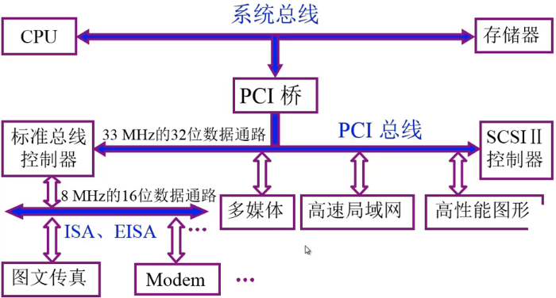
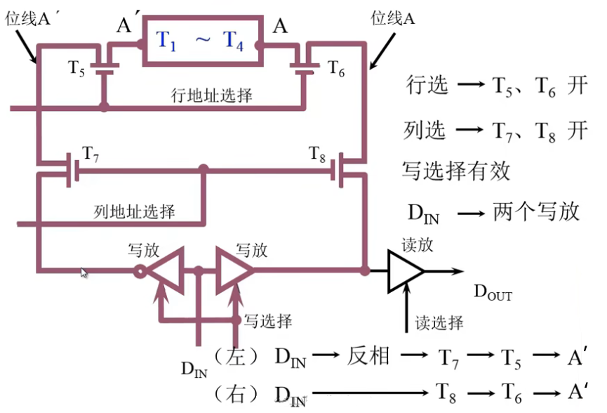
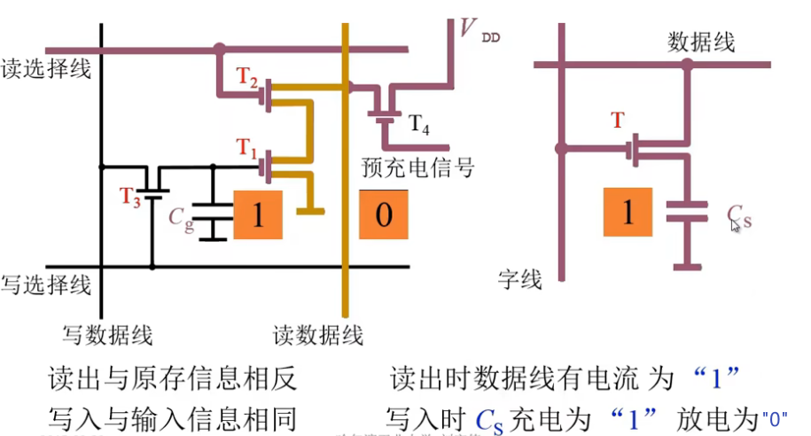
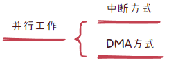
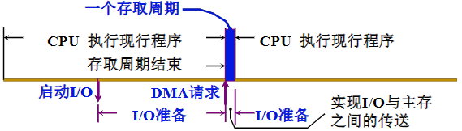

# 计算机组成原理


## 课程简介


### 课程关键词

1. 计算机：机械式计算机、模拟电子计算机、<font color='red'>数字电子计算机</font>（现）
2. 组成：计算机硬件系统的逻辑实现
3. 原理：计算机发展过程中多种数字电子计算机实现的公共原理

### 讲授内容

1. 基本部件的结构和组织方式
2. 基本运算的操作原理
3. 基本部件和单元的设计思想

### 特色

1. 计算机组成的一般原理，不以具体机型为依托
2. 采用自上而下的方式、层层细化

### 教材

《计算机组成原理（第2版）》——唐朔飞

《Computer Organization and Design》——David A.Patterson.  John L.Hennessy

《Digital Design and Computer》——David Harris，Sarah Harris.

### 课程结构


### 课程的分割整合

##### 计算机组成原理之机器

1. 计算机系统的基本概念
2. 总线
3. 存储器
4. 输入输出系统

##### 计算机组成之数字

1. 计算机中数的表示
2. 计算机的运算方法和运算器

##### 计算机组成原理之CPU

1. 指令系统
2. CPU的结构和功能
3. 控制单元
4. 控制单元的设计

## 第一章  计算机系统概论

### 1.1 计算机系统简介

- 现代计算机的多态性

  ​	把**<font color='red'>感应器</font>**嵌入和装备到<u><font color='red'>电网、铁路、桥梁、隧道公路、建筑、供水系统、大坝、油气管道等各种物体中</font></u>，并且被普遍连接，形成所谓**<font color='red'>“物联网”</font>**，然后将**<font color='red'>“物联网”</font>**与现有的互联网整合起来，实现人类社会与物理系统的整合，形成智慧地球

#### 一、计算机的软硬件概念

1. **计算机系统**


​		**软件：**


​		**简单的层次结构：**


#### 二、计算机系统的层次结构

- 系统复杂性的管理方法 -1


​		                

​	

​	**问**： 计算机组成与计算机系统结构或者计算机体系结构从研究内容上的区别？

​	**答：** 计算机系统结构定义了计算机系统的软硬件的交界面，定义了哪些功能由硬件实现，哪些功能由软件实现，提供了上层软件在编写时和硬件进行交互的接口。

#### 三、计算机体系结构和计算机组成

​	计算机体系结构：计算机系统属性概念性的结构和功能特性（指令系统、数据类型、寻址技术、I/O机理）

​	计算机组成：实现计算机体系结构所体现的属性（具体指令的实现）


### 1.2 计算机的基本组成


#### 一、冯·诺依曼计算机的特点

1. 计算机由五大部件组成
2. 指令和数据以同等地位存于存储器，可按地址寻访
3. 指令和数据用二进制表示
4. 指令由操作码和地址码组成 
5. <font color='red'>存储程序</font>
6. 以运算器为中心


**通用电子计算机方案e d v a c** 

- ​	e：电子
- ​	d：离散的
- ​	v：变量
- ​	a：自动化
- ​	c：计算机
  


#### 二、冯诺依曼计算机硬件框图


1. **以存储器为中心的计算机硬件框图**


```latex
                    实线：数据通路				虚线：控制和状态反馈
                    运算器（核心）：完成算术运算和逻辑运算
                    存储器：存放数据和程序
                    控制器：指挥控制程序运行，控制指令之间先后运行
                    输入设备：将信息转换成机器能够识别的语言
                    输出设备：将结果转换成人们熟悉的形式
```

2. **现代计算机硬件框图**


​	**系统复杂性管理的方法-2（3’Y）**

​		- 层次化（Hierachy）：将被设计的系统划分为多个模块或子模块

​		- 模块化（Mondularity）：有明确定义（well-defined）的功能和接口

​		- 规则性（Regularity）：模块更容易被重用

#### 三、计算机工作步骤

1. 上机前的准备

- 建立数学模型

$$
u=U_{m}Sin\omega t
$$

- 确定计算方法

$$
\sin x=x-{\frac{x^{3}}{3!}}+{\frac{x^{5}}{5!}}-{\frac{x^{7}}{7!}}+{\frac{x^{9}}{9!}}-\cdots
$$

$$
Y_{n+1}={\frac{1}{2}}\left(y_{n}+{\frac{x}{y_{n}}}\right)\left(\ n=0,1,2,\ \cdots\right)
$$


- 编制解题程序

​					(1) 程序——运算的全部步骤

​					(2) 指令——每一个步骤  

​		加法指令、乘法指令、取数指令、存数指令、打印指令、停机指令

​								eg.  


​		指令格式							

​								eg. 


```html
		ACC：寄存器（ACC累加器）中保存的内容

		000001:6位 操作码 可以分别进行编码

		0000001000：地址码  操作数实际所在的物理地址
```

**计算****程序清单**

<table align="center">
<thead align="center">
  <tr>
    <th rowspan="2">指令和数据存于主存单元的地址</th>
    <th colspan="2">指令</th>
    <th rowspan="2">注释</th>
  </tr>
  <tr>
    <th>操作码</th>
    <th>地址码</th>
  </tr>
</thead>
<tbody align="center">
  <tr>
    <td>0</td>
    <td>000001</td>
    <td>0000001000</td>
    <td>取数x至ACC</td>
  </tr>
  <tr>
    <td>1</td>
    <td>000100</td>
    <td>0000001001</td>
    <td>乘a得ax，存于ACC中</td>
  </tr>
  <tr>
    <td>2</td>
    <td>000011</td>
    <td>0000001010</td>
    <td>加b得ax+b，存于ACC中</td>
  </tr>
  <tr>
    <td>3</td>
    <td>000100</td>
    <td>0000001000</td>
    <td>乘x的（ax+b）x，存于ACC中</td>
  </tr>
  <tr>
    <td>4</td>
    <td>00011</td>
    <td>0000001011</td>
    <td>加c的ax^{2}+bx+c,存于ACC中</td>
  </tr>
  <tr>
    <td>5</td>
    <td>000110</td>
    <td>0000001100</td>
    <td>将ax^{2}+bx+c，存于主存单元</td>
  </tr>
  <tr>
    <td>6</td>
    <td>000101</td>
    <td></td>
    <td>打印</td>
  </tr>
  <tr>
    <td>7</td>
    <td>000110</td>
    <td></td>
    <td>停机</td>
  </tr>
  <tr>
    <td>8</td>
    <td colspan="2">x</td>
    <td>原始数据x</td>
  </tr>
  <tr>
    <td>9</td>
    <td colspan="2">a</td>
    <td>原始数据a</td>
  </tr>
  <tr>
    <td>10</td>
    <td colspan="2">b</td>
    <td>原始数据b</td>
  </tr>
  <tr>
    <td>11</td>
    <td colspan="2">c</td>
    <td>原始数据c</td>
  </tr>
  <tr>
    <td>12</td>
    <td colspan="2"></td>
    <td>存放结果</td>
  </tr>
</tbody>
</table>


- 指令和数据都是保存在存储器中的

2. 计算机的解题过程

**（1）存储器的基本组成**


​				MAR：存储地址寄存器 ( 反映存储单元的个数 )

​				MDR：存储数据寄存器 ( 反映存储字长 )


​			存储器—存储单元—存储元件（0/1）

​			eg. 大楼—房间—床位（有人/无人）

- ​			存储单元：存放单元中一串二进制代码
- ​			存储字：存储单元中二进制代码的组合
- ​			存储字长：存储单元中二进制代码的位数，每个存储单元赋予一个地址
- ​			按地址寻访：赋予每个存储单元一个地址号，按存储单元的地址号实现对存储字的存 (写入)、取 (读出)

​		运算器的结构：（通用/状态）寄存器、执行部件、控制电路

**（2）运算器的基本组成及操作过程**


```html
			ACC：累加器
			ALU（核心）：算数逻辑单元
			X：操作[寄存器]
			MQ：乘商寄存器
```

|      |     ACC      |      MQ       |   X    |
| :--: | :----------: | :-----------: | :----: |
| 加法 |   被加数和   |               |  加数  |
| 减法 |   被减差数   |               |  减数  |
| 乘法 |   乘积高位   | 乘数 乘积低位 | 被乘数 |
| 除法 | 被除数、余数 |      商       |  除数  |

​		①加法操作过程


​		②减法操作过程


​		③乘法操作过程


​		④除法操作过程


​	控制器的基本结构：

​	[Day5：Part4——控制器的结构和功能 - 知乎 (zhihu.com)](https://zhuanlan.zhihu.com/p/553181920)

​	控制器的功能：

- [x] ​	解释指令
- [x] ​	保证指令的按序进行

**（3）控制器的基本组成：**


​	运算器、控制器、存储器构成了什么？

- ​	一条指令在主机上的完成过程
- ​	程序在主机上是如何执行的

**（4）主机完成一条指令的过程**

​	eg. 取数指令


​	eg. 存数指令


**（5）程序的运行过程**

- ​	将程序跳过输入设备送至计算机
- ​	程序首地址 —> PC
- ​	启动程序运行取指令 PC —> MAR —> M —> MDR —> IR
- ​	分析指令 OP（IR）—> CU
- ​	执行指令 Ad(IR) —> MAR —> M —> MDR —> ACC
- ​	...
- ​	打印结构
- ​	停机


### 1.3计算机硬件的主要技术指标

**（1）机器字长**

​		 CPU一次能处理数据的位数

​		 与CPU中的<font color='red'>寄存器位数</font>有关

**（2）运算速度**


**（3）存储容量**

​		 存放二进信息的总位数


## 第二章  计算机的发展及应用


### 2.1 计算机的发展史

#### 一、计算机的产生和发展


- 现代计算机产生的驱动力：**<font color='red'>需求</font>**


- 技术发展：电子技术的发展、计算机体系结构技术的发展


- 硬件技术对计算机迭代的影响：


|  代  |    时间     |     硬件技术     | 速度（次/s） |
| :--: | :---------: | :--------------: | :----------: |
|  一  | 1946 - 1957 |      电子管      |    40 000    |
|  二  | 1958 - 1964 |      晶体管      |   200 000    |
|  三  | 1965 - 1971 | 中小规模集成电路 |  1 000 000   |
|  四  | 1972 - 1977 |  大规模集成电路  |  10 000 000  |
|  五  |  1978至今   | 超大规模集成电路 | 100 000 000  |

​	**约翰·冯·诺伊曼（John von Neumann）系统结构的计算机**

​																	  IAS逻辑结构


​	**IBM System / 360**（1961研制、1964研制成功）


```latex
						系列产品（高性能产品指令可在低性能产品上运行）
						使计算机从低速发展时代直接跨入高速发展时代
						提出了”计算机体系结构“概念（产生系列机和兼容机）
						软、硬件可以同时进行，缩短周期，可同时进行不同的任务
```


#### 二、微型计算机的出现和发展

​	微处理器芯片的发展

| 微处理器（1971年） | 存储器芯片（1970年） |
| :----------------: | :------------------: |
|    4位（4004）     |        256位         |
|        8位         |         1K位         |
|        16位        |         4K位         |
|        32位        |        16K位         |
|        64位        |        64K位         |
|                    |        256K位        |
|                    |         1M位         |
|                    |         4M位         |
|                    |        16M位         |
|                    |        64M位         |

​	Intel公司的经典微处理器产品

| 8080        | 8位        | 1974年 |                  |
| ----------- | ---------- | ------ | ---------------- |
| 8086        | 16位       | 1979年 | 2.9w个晶体管     |
| 80286       | 16位       | 1982年 | 13.4w个晶体管    |
| 80386       | 32位       | 1985年 | 27.5w个晶体管    |
| 80486       | 32位       | 1989年 | 120.0w个晶体管   |
| Pentium     | 64位（准） | 1993年 | 310.0w个晶体管   |
| Pentium Pro | 64位（准） | 1995年 | 550.0w个晶体管   |
| Pentium Ⅱ   | 64位（准） | 1997年 | 750.0w个晶体管   |
| Pentium Ⅲ   | 64位（准） | 1999年 | 950.0w个晶体管   |
| Pentium Ⅳ   | 64位       | 2000年 | 4 200.0w个晶体管 |

​		目前芯片上可集成的晶体管数量超过 30 亿


```latex
                摩尔（Moore）定律
							Intel公司的缔造者之一 Gordon Moore 提出：
							微芯片上集成的晶体管数量每三年翻两番
```


#### 三、软件技术的兴起和发展

1. 各种语言

| 机器语言 | 面向机器           |
| -------- | ------------------ |
| 汇编语言 | 面向机器           |
| 高级语言 | 面向机器           |
| FORTRAN  | 科学计划和工程计算 |
| PASCAL   | 结构化程序设计     |
| C++      | 面向对象           |
| JAVA     | 适应网络环境       |

2. 系统软件

| 语言处理程序   | 汇编语言、编译程序、解释程序 |
| -------------- | ---------------------------- |
| 操作系统       | DOS、UNIX、Windows、Linux    |
| 服务性程序     | 装备    调试    诊断    排错 |
| 数据库管理系统 | 数据库和数据库管理软件       |
| 网络软件       |                              |

3. 软件发展的特点

（1）开发周期长

（2）制作成本高昂

（3）检测软件产品质量的特殊性

​		软件是程序以及开发、使用和维护所需要的所有文档


### 2.2 计算机的应用


#### 一、科学计算和数据处理

（1）科学计算（又名数值计算）

​		特点：计算量大、数值变化范围大

​		eg. 天气预报、天文、量子化、航天航空

（2）数据处理

​		计算机收集、存储、整理、检索


#### 二、工业控制和实时控制

传感器和执行器、控制算法、通信协议、数据采集和处理、人机界面


#### 三、网络技术

（1）电子商务（2）网络教育（3）敏捷制造


#### 四、虚拟现实

图形学、计算机视觉、人机交互、物理模拟、声音处理

#### 五、办公自动化和管理信息系统

数据库管理、网络管理、软件开发、信息安全


#### 六、CAD/CAM/CIMS

计算机图形学、数值控制、工艺规划、数据库管理


#### 七、多媒体技术

图像处理、音频处理、视频处理、人机交互


#### 八、人工智能

​	机器学习、深度学习、自然语言处理、计算机视觉


### 2.3 计算机的展望

#### 一、计算机具有类似人脑的一些超级智能功能

​	要求计算机的速度要足够快


#### 二、芯片集成度的提高受以下三方面的限制

- ​	芯片集成度受物理极限的制约
- ​	按集合级数递增的制作成本
- ​	芯片的功耗、散热、线延迟


#### 三、？替代传统的硅芯片

1. 光计算机

​		利用光子取代电子进行运算和存储

```latex
	光计算机是一种概念性的计算机技术，旨在使用光子而不是传统的电子信号来进行信息处理。与传统的硅芯片相比，光计算机具有一些潜在的优势和挑战：

优势：
	1、速度：光子传输速度比电子快，可以实现更快的数据传输和处理速度，这在高性能计算和大规模数据处理中可能具有优势。
	2、能效：光子不会散热，因此光计算机在某些情况下可以更能效，降低能耗。
	3、信号传输距离：光子信号在传输过程中不会受到电阻和电磁干扰的影响，因此可以实现长距离传输而不损失信号质量。
	4、高带宽：光子系统可以支持高带宽的数据传输，适用于需要大量数据传输的应用领域。

挑战：
	1、技术难题：光计算机技术仍然处于研发阶段，存在许多技术难题需要克服，包括制造高效的光源、集成光电子元件和开发光学计算逻辑等方面。
	2、成本：目前，光学元件的制造和集成成本相对较高，这限制了光计算机的商业应用。
	3、兼容性：将光计算机与现有的电子计算机系统集成可能会面临一些兼容性问题。
	
	总之，光计算机有潜力在某些领域取代传统的硅芯片，但目前仍面临许多技术和商业挑战。随着技术的不断发展和改进，光计算机可能会逐渐在特定应用领域中发挥更大的作用，但在广泛替代传统硅芯片之前，还需要克服一些重要问题。
```

2. DNA生物计算机

​		通过控制DNA分子间的生化反应

```latex
	DNA生物计算机是一种概念性的计算技术，旨在利用DNA分子的生物化学性质进行信息存储和处理。与传统的硅芯片相比，DNA生物计算机有一些独特的特点和潜在的优势，但也存在一些挑战：

优势：
	1、数据密度：DNA分子具有极高的数据密度，可以在极小的体积内存储大量信息，远远超过硅芯片。
	2、并行性：DNA分子在处理信息时可以进行高度并行操作，因为数百万个分子可以同时进行反应，这在某些特定的计算任务中可能具有优势。
	3、长期存储：DNA可以长期存储信息，可以在不需要持续电力供应的情况下保存数据，这与传统硅芯片不同。

挑战：
	1、速度：与硅芯片相比，DNA计算机的处理速度较慢。DNA分子之间的相互作用需要时间，并且DNA计算通常需要较长的时间来执行。
	2、误差率：DNA计算容易受到生物化学反应和误差的影响，因此在信息处理中可能会引入错误。
	3、制造和操作复杂性：制造DNA计算机需要高度精确的生物化学技术，并且操作和维护这些系统可能会非常复杂。
	4、实用性：目前，DNA计算机技术仍然处于实验室阶段，远未达到商业应用的水平。将其应用于实际问题需要克服许多技术和成本挑战。
	
	综上所述，DNA生物计算机在某些特定的应用领域中可能具有潜在的优势，特别是在大规模数据存储方面。然而，要完全替代传统的硅芯片还需要克服许多技术和实用性挑战。目前来看，DNA生物计算机仍然处于研究和实验阶段，距离广泛应用还有很长的路要走。
```


3. 量子计算机

​		利用原子所具有的量子特征

```
	量子计算机与传统的硅芯片有一些重要的区别，因此不能简单地替代传统的硅芯片，而是在某些领域具有潜在的补充作用。以下是关于量子计算机与传统硅芯片的一些关键区别和考虑因素：

	1、计算能力：量子计算机在某些特定的计算任务上具有潜在的超越传统计算机的计算能力。例如，它们可以在一些复杂问题（如因子分解和优化问题）上提供指数级加速，这是传统计算机无法实现的。然而，在许多其他类型的计算任务上，传统硅芯片仍然表现出色。
	2、稳定性：量子比特（qubits）对环境非常敏感，容易受到噪声和干扰的影响，这是量子计算机面临的主要挑战之一。传统硅芯片在一般的工作环境下相对稳定。
	3、可编程性：传统硅芯片具有广泛的可编程性，可以用于执行各种应用程序，从通用计算到嵌入式系统。量子计算机目前还受到硬件和软件方面的限制，无法执行所有类型的任务。
	4、成本和复杂性：量子计算机的制造、操作和维护成本目前非常高昂，而传统硅芯片的生产成本相对较低。这使得量子计算机在短期内难以广泛应用。
	5、需要算法重构：要充分发挥量子计算机的潜力，需要重新设计和优化算法，以适应量子计算的特性。这意味着不是所有现有的软件都可以直接迁移到量子计算机上。
	
	综上所述，量子计算机不太可能完全替代传统的硅芯片，而是在某些领域提供有力的计算能力补充。在未来，随着量子计算技术的不断进步和成熟，它们可能会在特定的科学、工程和优化问题上发挥关键作用。但对于大多数日常计算任务，传统的硅芯片仍然是主要的计算平台。
```


## 第三章、系统总线

### 3.1总线的基本概念

#### 一、为什么要用总线

**总线**是计算机内部的一种通信方式，它连接了计算机内部的各个部件，如CPU、内存、硬盘、显卡等等。总线的作用是<u>在这些部件之间传递数据和控制信号，使它们能够相互协调工作。</u>


#### 二、什么是总线

总线是信号的公共传输线，是链接各个部件的信息传输线，是<font color='cornflowerblue'>各个部件共享的传输介质</font>


#### 三、总线上信息的传输


从技术发展的情况来看，串行传输方式大有彻底取代并行传输方式的势头，USB取代IEEE 1284，SATA取代PATA，PCI Express取代PCI……

从原理来看，并行传输方式优于串行传输方式。 

通俗地讲，并行传输的通路犹如一条多车道的宽阔大道，而串行传输则是仅能允许一辆汽车通过的乡间公路。

```latex
常见的高速信号传输方式：

	1、光纤传输：光纤传输利用光子的特性传输数据，因此具有极高的传输速度和带宽。它通常用于长距离通信和高速互联连接，如互联网骨干网络、数据中心内部的通信等。
	2、差分信号传输：差分信号传输是一种电信号传输方式，通过同时传输正和负的电压来表示数据位，从而减少信号干扰和噪声的影响。这种方式常见于高速差分信号总线、差分信号电缆和高速串行通信标准（如USB、HDMI、PCIe等）中。
	3、微带和同轴电缆：微带和同轴电缆是用于高频信号传输的传输线类型。它们广泛用于无线通信系统、射频（RF）设备和一些高速数字通信链路中。
	4、差分对传输：差分对传输将信号分为一对相反极性的导线，以减小信号传输时的电磁干扰。它常用于高速数字信号传输和以太网等网络通信。
	5、微波传输：微波通信利用高频微波信号进行数据传输，广泛用于卫星通信、雷达系统和一些点对点通信连接，特别是需要跨越远距离或在复杂环境中传输数据的情况。
	5、高速差分信号光纤：这种技术将差分信号和光纤结合，以实现高速、高带宽的光纤通信，常用于数据中心互连和超级计算机等高性能计算领域。
```


#### 四、总线结构的计算机举例

1. 单总线结构框图


数据总线连接了CPU、内存和I/O设备。CPU通过总线与内存进行数据读取和写入操作，还可以与I/O设备进行通信，以进行输入和输出操作。

优点：结构简单、成本较低

限制：数据传输速度可能受总线带宽限制


2. 面向CPU的双总线结构框图


这种双总线结构允许CPU并行进行数据传输和地址传输，提高了计算机的性能和效率。CPU可以同时读取或写入数据，而不必等待一个操作完成后才进行另一个操作。此外，地址总线允许CPU访问大范围的内存空间，这在现代计算机系统中是必要的。

优点：

- **提高性能：** 双总线结构允许CPU并行进行数据传输和地址传输，从而提高了计算机的性能。CPU可以同时执行多个数据读取和写入操作，而不必等待一个操作完成后才进行另一个操作。
- **支持大内存空间：** 地址总线的存在允许CPU访问大范围的内存地址，这在现代计算机系统中非常重要。更宽的地址总线可以支持更大的内存容量，这对于处理大型数据集或运行内存密集型应用程序至关重要。
- **灵活性：** 双总线结构具有灵活性，可以轻松适应不同类型的CPU和系统设计。它可以应用于多种计算机体系结构，包括单处理器和多处理器系统。

限制

- **复杂性：** 双总线结构相对于单总线结构更复杂。它需要额外的硬件支持，包括数据总线、地址总线和控制总线，这增加了系统设计和制造的复杂性和成本。
- **协调需求：** 为了确保数据和地址传输之间的协调，需要适当的控制逻辑。这可能导致较高的功耗和设计复杂度。
- **不足的带宽：** 尽管双总线结构提高了性能，但在某些高性能计算环境下，数据总线的带宽可能仍然不足以满足需求。在这种情况下，可能需要采用更高级别的总线结构或其他高速互连技术。
- **硬件成本：** 双总线结构需要更多的硬件资源，这可能会增加计算机系统的成本。较宽的数据总线和地址总线需要更多的针脚和电路板空间，这可能导致成本增加。


3. 以存储器为中心的双总线结构框图


这种以存储器为中心的双总线结构允许CPU访问存储器中的数据和指令，同时也支持与外部I/O设备进行通信。

优点：

- **高性能：** 允许CPU快速访问存储器中的数据和指令，从而实现高性能的计算操作。CPU可以通过地址总线和数据总线快速传输数据。
- **大内存容量：** 地址总线的存在允许计算机支持大内存容量。通过扩展地址总线的宽度，可以访问更多的存储单元，对于处理大型数据集和运行内存密集型应用程序至关重要。
- **灵活性：** 具有一定的灵活性，允许CPU与存储器和I/O设备进行交互。CPU可以从存储器中读取数据和指令，并与外部设备进行通信，增加了计算机的功能和用途。

限制：

- **瓶颈问题：** 双总线结构可能会导致数据总线成为系统的瓶颈。当CPU需要高带宽的数据传输时，数据总线的带宽限制可能会降低性能。
- **复杂性：** 实现双总线结构需要额外的硬件支持和控制逻辑，这增加了系统的复杂性和成本。较宽的地址总线和数据总线需要更多的电缆、针脚和电路板空间。
- **时序问题：** 为了确保各个部分的协调操作，需要适当的时序和控制。这可能需要额外的硬件来管理总线冲突、互锁和数据同步，增加了设计和维护的复杂性。
- **不足的灵活性：** 在某些情况下，双总线结构可能不足以满足某些高级应用程序的需求，例如分布式计算和高性能计算集群。在这些情况下，可能需要采用其他互连技术来提供更高的性能和灵活性。


### 3.2总线的分类

##### 			一. 片内总线

​	<font color='cornflowerblue'>芯片内部</font>的总线

##### 			二. 系统总线

​	<font color='cornflowerblue'>计算机各部件之间</font>的信息传输线

​		数据总线	（<font color='cornflowerblue'>双向</font>）与机器字长、存储字长有关

​		地址总线	（<font color='cornflowerblue'>单向</font>）与存储地址、I/O地址有关

​		控制总线	（<font color='cornflowerblue'>有出</font>：存储器读、存储器写、总线允许、中断确认）

​						 （<font color='cornflowerblue'>有入</font>：中断请求、总线请求）

##### 			三. 通信总线

​	计算机系统之间or计算机系统与其他系统之间 的通信


### 3.3总线特性及性能指标

#### 		一、总线物理实现


#### 		二、总线特性

1. **机械特性**	<font color='cornflowerblue'>尺寸</font>、形状、<font color='cornflowerblue'>管脚数</font> 及 <font color='cornflowerblue'>排列顺序</font>

2. **电器特性**    <font color='cornflowerblue'>传输方向</font>和有效的<font color='cornflowerblue'>电平</font>范围

3. **功能特性**    每根传输线的功能（地址、数据、控制）

4. **时间特性**    信号的<font color='cornflowerblue'>时序</font>关系

#### 		三、总线的性能指标

- 总线宽度				 <font color='cornflowerblue'>数据线</font>的根数

- 标准传输率            每秒传输的最大字节数(<font color='cornflowerblue'>MBps</font>)

- 时钟同步/异步        <font color='cornflowerblue'>同步</font>、<font color='cornflowerblue'>不同步</font>

- 总线复用               <font color='cornflowerblue'>地址线</font>与<font color='cornflowerblue'>数据线</font>复用（eg. 8086端口）

- 信号线数               地址线、数据线和控制线的<font color='red'> 总和</font>

- 总线控制方式         突发、自动、仲裁、逻辑、计数

- 其他指标               <font color='cornflowerblue'>负载能力</font>

#### 		四、总线标准 

|    总线标准    |      数据线      |                           总线时钟                           | 带宽                                                         |
| :------------: | :--------------: | :----------------------------------------------------------: | ------------------------------------------------------------ |
|      ISA       |        16        |                        8 MHz（独立）                         | 16MBps                                                       |
|      EISA      |        32        |                        8 MHz（独立）                         | 33MBps                                                       |
| VESA（VL-BUS） |        32        |                        32 MHz（CPU）                         | 132MBps                                                      |
|      PCI       |    32<br />64    |              33 MHz（独立）<br />66 MHz（独立）              | 132MBps<br />528MBps                                         |
|      AGP       |        32        |            66.7 MHz（独立）<br />133 MHz（独立）             | 266MBps<br />533MBps                                         |
|     RS-232     | 串行通信总线标准 | 数据终端设备（计算机）和数据通信设备（调制解调器）之间的标准接口 |                                                              |
|      USB       | 串行接口总线标准 |         普通无屏蔽双绞线<br />带屏蔽双绞线<br />最高         | 1.5MBps（USB 1.0）<br />12MBps（USB 1.0）<br />480MBps（USB 2.0） |


### 3.4总线结构

#### 		一、单总线结构


特点：

- **简单性：** 单总线结构相对于其他复杂的总线结构来说非常简单，易于理解和实现。它通常用于教育和初学者的计算机系统中，以帮助他们理解基本的数据传输和控制信号概念。
- **成本效益：** 由于单总线结构的简单性，它通常具有较低的硬件成本，适用于一些嵌入式系统和小型计算机系统，这些系统通常要求成本效益高。
- **基本功能：** 单总线结构具备计算机所需的基本功能，包括数据传输和控制信号传递。虽然它不适用于高性能计算，但对于一些基本的任务和应用来说足够了。
- **有限带宽：** 单总线结构的带宽有限，这意味着它在高速数据传输方面存在限制。对于大规模数据处理和复杂计算任务来说，带宽可能会成为性能瓶颈。
- **总线冲突：** 由于多个设备共享同一根总线，可能会发生总线冲突，即多个设备同时尝试使用总线时可能会导致冲突。这需要适当的总线仲裁和控制来解决。
- **适用性：** 单总线结构适用于一些基本的计算机系统和嵌入式系统，例如小型控制器、传感器节点和嵌入式控制系统。但在需要高性能和可扩展性的系统中，通常会选择更复杂的总线结构。


#### 		二、多总线结构

1. 双总线结构


特点：

- **分离存储器和I/O操作：** 双总线结构将主存总线（Memory Bus）和I/O总线（I/O Bus）分开，从而允许CPU分别访问主存储器和I/O设备。这种分离允许CPU在不干扰主存储器操作的同时，与外部设备进行数据交换。
- **并行数据传输：** 双总线结构允许主存总线和I/O总线同时传输数据，从而提高了数据传输的效率。CPU可以在与主存储器的数据传输同时与I/O设备进行通信。
- **地址空间分离：** 双总线结构通常会将主存储器和I/O设备的地址空间分开。这意味着CPU使用不同的地址范围来访问主存储器和I/O设备。例如，主存储器可能位于0x0000到0xFFFF的地址范围内，而I/O设备可以位于另一个地址范围内。
- **控制信号分离：** 双总线结构还分离了主存总线和I/O总线的控制信号。这使得CPU能够在执行主存储器操作时，与I/O设备进行并行的输入和输出操作。不同的控制信号指导了数据的传输方向和操作类型。
- **提高系统性能：** 双总线结构有助于提高计算机系统的性能。它允许CPU在执行计算任务时仍然能够同时进行输入/输出操作，从而减少了CPU的闲置时间。
- **适用于多任务处理：** 双总线结构对于支持多任务处理和多线程操作系统非常有用。CPU可以同时与主存储器和多个I/O设备进行通信，以满足多任务环境中的需求。


2. 三总线结构


特点：

- **分离数据传输和控制信号：** 三总线结构将数据传输和控制信号分离到不同的总线上，这有助于提高系统性能和可扩展性。主要特点如下：
  - **I/O总线：** 用于连接CPU与外部I/O设备，包括键盘、鼠标、显示器、磁盘驱动器等。I/O总线允许CPU与这些设备进行输入和输出操作，同时保持与主存和DMA控制器的独立连接。
  - **主存总线：** 用于CPU与主存（RAM）之间的数据传输。主存总线的高带宽支持CPU与主存之间的高速数据交换，这对于执行计算和访问程序和数据非常重要。
  - **DMA总线：** 用于直接内存访问（DMA），允许外部设备（如磁盘控制器）直接与主存进行数据传输，而无需CPU的干预。DMA总线可以减轻CPU的负担，提高数据传输效率。
- **高性能和并发操作：** 三总线结构支持高性能操作，因为CPU、I/O设备和DMA控制器可以并行工作。CPU可以同时与主存交换数据，I/O设备可以与CPU并行进行输入和输出操作，DMA控制器可以独立进行数据传输。
- **支持多任务操作：** 由于CPU可以与主存和I/O设备并行操作，因此三总线结构支持多任务操作系统，允许多个任务同时运行。这有助于提高系统的多任务性能和响应时间。
- **总线冲突的减少：** 三总线结构减少了总线冲突的可能性，因为不同类型的数据传输（CPU与主存、CPU与I/O设备、DMA控制器与主存等）可以在各自的总线上进行，而不会干扰彼此。
- **可扩展性：** 三总线结构具有一定的可扩展性，允许添加更多的I/O设备和DMA控制器，以满足不同应用的需求。


3. 三总线结构又一形式


特点：

- **高性能内部通信：** 通过局部总线，CPU能够快速地与内部高速缓存和寄存器等组件进行通信，提高了计算机的性能。
- **系统级通信：** 系统总线连接了计算机内部的核心组件，使CPU能够与主存储器和外部设备进行数据交换。这种通信是计算机操作的基础，支持程序执行和数据存取。
- **可扩展性：** 拓展总线允许用户扩展计算机系统的功能，通过添加外部设备或扩展卡来满足不同的需求。
- **分层设计：** 三总线结构的分层设计使计算机系统更具可维护性和可升级性。内部通信、系统级通信和外部扩展都有各自的总线，降低了各部分之间的耦合度。
- **适应性：** 这种结构适用于多种计算机系统，包括台式计算机、工作站和服务器，因为它可以在高性能、内存扩展和外部设备连接等方面进行定制。


4. 四总线结构


特点：

- **分层结构：** 四总线结构将计算机系统的总线分为四个不同的层次，每个层次具有不同的功能和用途。这种分层结构有助于管理和组织系统内部的数据传输和控制。
- **局部总线（Local Bus）：** 局部总线连接CPU与内部高速缓存、寄存器文件以及其他CPU核心组件。这个总线通常具有较高的带宽，用于快速的内部数据传输。
- **系统总线（System Bus）：** 系统总线连接了CPU、内存、主板上的其他主要组件（如北桥芯片）和高速扩展插槽（如PCIe插槽）。系统总线用于CPU与主存储器之间的数据传输，以及CPU与其他主板组件之间的通信。
- **高速总线（High-Speed Bus）：** 高速总线用于连接主板上的高速设备，例如图形卡（GPU），磁盘控制器等。这些设备通常需要更高的带宽来处理大量数据，因此高速总线提供了更高的传输速度。
- **拓展总线（Expansion Bus）：** 拓展总线用于连接外部设备，例如扩展卡（如显卡、声卡、网卡等）和外部存储设备。它通常是标准的总线接口，允许用户添加额外的硬件组件。
- **多层次通信：** 四总线结构允许多层次的通信。CPU可以通过局部总线与内部组件通信，通过系统总线与主存储器和主板上的其他组件通信，通过高速总线与高性能设备通信，通过拓展总线与外部设备通信。
- **可扩展性：** 四总线结构支持系统的可扩展性，因为它允许用户添加更多的设备和组件，而无需修改核心系统总线。这使得计算机可以根据需求进行升级和扩展。
- **高性能：** 由于分层结构和高速总线的存在，四总线结构通常具有较高的性能。CPU可以更快地与内部和外部设备通信，从而提高系统的整体性能。


#### 		三、总线结构举例

1. 传统微型机总线结构


2. VL-BUS局部总线结构


3. PCI总线结构



4. 多层PCI总线结构


### 3.5总线控制

#### 		一、总线判优控制

1. 基本概念


2. 链式查询方式


3. 计数器定时查询


4. 独立请求方式


#### 		二、总线通信控制

1. 目的：解决通信双方协调配合问题
1. 总线传输周期


3. 总线通信的四种方式


​	（1） 同步式数据输入 


​						

​	（2）同步式数据输出


​						T1：上升沿给出地址信息，下降沿给出数据

​						T2：上升沿给出写命令，向从设备进行数据导入

​						T3：上升沿做写入操作

​						T4：上升沿CPU或主设备可以销毁数据，撤销写命令

​						周期结束：撤销地址信息

​	（3）异步通信


​	（4）半同步通信（同步、异步结合）

​					同步	发送方用系统时钟前沿发信号

​								接受方用系统时钟后沿判断、识别 

​					异步	允许不同速度的模块和谐工作

​								增加一条“等待”响应信号


```html
		以输入数据为例的半同步通信时序
			T1	主模块发送地址
			T2	主模块发送命令
			Tw	当 WAIT 为低电平时，等待一个T
			Tw	当 WAIT 为低电平时，等待一个T（前提：前一个周期未收到信号）

			...

			T3	从模块提供数据
			T4	从模块撤销数据，主模块撤销命令
```

​		

​	上述三种通信的共同点：

​		一个总线的传输周期（以输入数据为例）：

​			主模块发地址、命令	占有总线

​			从模块准备数据	不占用总线	总线空闲

​			从模块向主模块发送数据	占用主线


​	（5）分离式通信

​			充分挖掘系统总线每个瞬间的潜力

​			一个总线传输周期


## 第四章 存储器

### 4.1 概述

#### 				一、存储器分类

1. 按存储介质分类

​		（1）半导体存储器（**易丢失**）	TTL、MOS

​		（2）磁表面存储器	磁头、载磁体

​		（3）磁芯存储器	硬磁材料、环装元件

​					例：


​					x、y轴方向上的导线：寻址

​					x、y轴交叉圆环：其中通过的电流超过改变磁场方向阈值所需电流（磁化磁心的电流）

​		（4）光盘存储器	激光、磁光材料

2. 按存取方式分类


3. 按存取方式分类


#### 			二、存储器的层次结构

1. 存储器的三个主要特性的关系


​				体系结构寄存器


2. 缓存——主存层次 和 主存——辅存层次


### 4.2 主存储器

#### 				一、概述

1. 主存的基本组成


​				数据总线连接 MDR 和 主存储器

​				处理器通过地址总线将内存地址传输给MAR

2. ##### 主存和CPU的联系


3. ##### 主存中存储单元的地址分配

​				eg. 如何将12345678H这个数据存储到主存储器中？


4. 主存的技术指标

​		（1）存储容量	

​						主存存放的二进制代码的总位数

​		（2）存储速度


```latex
		为什么存取时间比存取周期要短？
		答：存取时间包括了存取周期和内存控制器、内存总线传输时间的影响。存取周期只考虑了内存芯片执行读或写操作所需的时间，忽略了其他因素的影响，因此存取时间通常比存取周期长。
```

​		（3）存储器的带宽

​							位/秒

#### 			二、半导体存储芯片简介

1. 半导体存储芯片的基本结构


2. 存储芯片片选线的作用

​		（1）*选中存储芯片：当CPU需要访问多个存储芯片时，需要通过片选线来选中特定的存储芯片。通过控制片选线的状态，CPU可以选择与哪个存储芯片进行数据传输。

​		（2）*减少冲突：片选线还可以用于减少数据冲突。当多个存储芯片共享同一个数据总线时，如果没有片选线的控制，存储芯片会互相干扰，导致数据读写错误。通过使用片选线，CPU可以控制仅选中需要访问的存储芯片，避免冲突。

​		（3）*提高效率：片选线还可以用于提高数据传输效率。当CPU需要访问多个存储芯片时，通过片选线来控制访问的先后顺序，可以避免多个存储芯片之间的竞争，提高数据传输效率。


3. 半导体存储芯片的译码驱动方式

​		（1）线选法


​		（2）重合法


#### 				三、随机存取存储器（RAM）

1. 静态RAM（SRAM）

​		（1）静态RAM基本电路


​					读 操作


​					写 操作



​			（2）静态RAM芯片举例

​					①Intel 2114外特性


​					②Intel 2114 RAM矩阵（64 X 64）读


​					③Intel 2114 RAM矩阵（64 X 64）写


​			（3）提问与回答

```latex
		保存0和1的原理是什么？
		答：SRAM的基本存储单元是一个双稳态电路，也被称为存储单元或存储单元器件。每个存储单元包括两个互补的MOSFET（金属氧化物半导体场效应晶体管），一个用于存储“0”，一个用于存储“1”。当输入信号为高电平时，一个MOSFET通，另一个关闭，相应的存储单元存储“1”；当输入信号为低电平时，另一个MOSFET通，一个关闭，相应的存储单元存储“0”。

		基本单元电路的构成是什么？
		答：SRAM的基本存储单元是一个双稳态电路，由两个互补的MOSFET组成。其中一个MOSFET的源极和栅极相连，另一个MOSFET的漏极和栅极相连，两个MOSFET的源/漏极分别对应存储单元的“0”和“1”。

		对单元电路如何读出和写入？
		答：SRAM的读出操作通过在所需的存储单元上选通读出线路并传递读出脉冲进行，该脉冲通过读出线路被传递到存储单元的栅极上。读出脉冲使存储单元处于放大状态，从而将存储单元中存储的数据传递到读出线路中。SRAM的写入操作通过在所需的存储单元上选通写入线路并传递写入脉冲进行，该脉冲通过写入线路被传递到存储单元的栅极上。写入脉冲使存储单元的电荷状态发生变化，从而改变存储单元中存储的数据。

		典型芯片的结构是什么样子？
		答：SRAM芯片通常由多个存储单元组成，每个存储单元都由一个双稳态电路构成。芯片还包括地址译码器、写入寄存器、读出寄存器等其他逻辑电路，以及用于连接芯片和处理器的引脚。SRAM的芯片结构通常较为简单，可根据需要进行扩展和定制。

		静态RAM芯片如何进行读出和写入操作？
		答：SRAM的读操作是通过选通需要读取的存储单元的读出线路和传递读出脉冲来实现。读出脉冲传递到存储单元的栅极时，存储单元处于放大状态，数据就会被传递到读出线路中。写操作是通过选通需要写入的存储单元的写入线路并传递写入脉冲来实现。写入脉冲传递到存储单元的栅极时，存储单元的电荷状态发生变化，数据就会被改变。SRAM的读和写操作需要使用地址译码器来选择存储单元。同时，SRAM需要通过引脚连接到处理器，以实现数据传输和控制信号的交互。
```

2. 动态RAM（DRAM）

​			（1）动态RAM基本单元电路



​			（2）动态RAM芯片举例

​					①三管动态RAM芯片（Intel 1103）读


​					②三管动态RAM芯片（Intel 1103）写 


​					③单管动态RAM 4116（16K × 1位）外特性


​					④4116（16K × 1位）芯片 读 原理


​					⑤4116（16K × 1位）芯片 写 原理


​			（3）动态RAM刷新

​						<font color='cornflowerblue'>刷星与行地址有关</font>

​					①集中刷新	（存取周期为0.5μs）

​						eg. 128 × 128矩阵


​						<font color='cornflowerblue'>“死区”</font>为	0.5μs × 128 = 64μs

​						<font color='cornflowerblue'>“死时间率”</font>为	128/4 000 × 100% = 3.2%

​					②分散刷新	（存取周期为1μs）

​						eg. 128 × 128矩阵


​					③分散刷新与集中刷新相结合	（异步刷新）

​						eg. 128 × 128矩阵	（存取周期为0.5μs）

​						若每隔15.6μs刷新一行


​						每行每隔<font color='cornflowerblue'>2ms</font>刷新一次		<font color='cornflowerblue'>“死区”为0.5</font>

​						<font color='cornflowerblue'>将刷新安排在指令译码阶段，不会出现“死区”</font>

3. 动态RAM和静态RAM的比较

|              | DRAM（主存） | SRAM（缓存） |
| :----------- | :----------: | :----------: |
| **存储原理** |   **电容**   |  **触发器**  |
| **集成度**   |    **高**    |    **低**    |
| **芯片引脚** |    **少**    |    **多**    |
| **功耗**     |    **小**    |    **大**    |
| **价格**     |    **低**    |    **高**    |
| **速度**     |    **慢**    |    **快**    |
| **刷新**     |    **有**    |    **无**    |

#### 四、只读存储器（ROM）

- 早期的只读存储器——厂家写入，用户不可修改
- 改进1 —— 用户可自己写入数据 —— 一次性
- 改进2 —— 可多次写入数据 —— 信息可擦除
- 改进3 —— 电可擦写 —— 特定设备
- 改进4 —— 电可擦写 —— 直接连接到计算机

1. 掩模ROM（MROM）

​			行列选择线交叉处 <font color='red'>有</font> MOS管为“1”

​			行列选择线交叉处 <font color='red'>无</font> MOS管为“0”

2. PROM（一次性编程）


|    熔丝断    |   为“0”   |
| :----------: | :-------: |
| **熔丝未断** | **为“1”** |

3. EPROM（多次性编程）


|    D端加正电压    |    形成浮动栅    |  S与D不导通为“0”  |
| :---------------: | :--------------: | :---------------: |
| **D端不加正电压** | **不形成浮动栅** | **S与D导通为“1”** |

4. EEPROM(多次性编程)

| 电可擦写 | 局部擦写 | 全部擦写 |
| :------: | :------: | :------: |

5. Flash Memory（闪速型存储器）

|     EPROM      | 价格便宜、集成度高 |
| :------------: | :----------------: |
|   **EEPROM**   |  **电可擦洗重写**  |
| **比EEPROM快** |  **具备RAM功能**   |


#### 五、存储器与CPU的连接

1. 存储器容量的拓展

​	（1）位拓展（增加存储字长）


​	（2）字拓展（增加存储字的数量）


​	（3）字、位拓展


2. 存储器与CPU的连接


​		例：	解：

​	（1）写出对应的二进制地址码


​	（2）确定芯片的数量及类型

​	（3）分配地址线


​	（4）确定片选信号


​		CPU与存储器的连接图


#### 六、存储器的校验

1. 编码的最小距离

​	任意两组合法代码之间<font color='cornflowerblue'>二进制位数</font>的<font color='cornflowerblue'>最小差异</font>

<font color='cornflowerblue'>	编码的纠错、检错能力与编码的最小距离有关</font>
$$
L-1=D+C(D \geq C)
$$
​			L —— 编码的最小距离	L = 3

​			D —— 检测错误的次数	具有<font color='cornflowerblue'>一位</font>纠错能力

​			C —— 纠正错误的位数

​	<font color='cornflowerblue'>汉明码是具有纠错能力的编码</font>

2. 汉明码的组成

- ​		汉明码采用奇偶校验
- ​		汉明码采用分组校验
- ​		汉明码的分组是一种非划分方式

​	（1）组成汉明码的三要素

​		①汉明码的组成需要增添 <font color='cornflowerblue'>？</font>位检测位
$$
2^k \geq n + k + 1
$$
​		②检测位的位置
$$
2^i(i=0,1,2,3,…)
$$
​		③检测位的取值

​	<font color='cornflowerblue'>检测位的取值与其所在的检测“小组”（与其相关的数据位）所承担的奇偶性校验负责关系有关。</font>

​	（2）各检测位C_i所承担的检测小组为


$$
g_i小组独占2^{i - 1}位 位置的二进制编码位0…10…0\\
g_i和g_j小组共占第2^{i-1}+2^{j-1}位 位置的二进制编码为0…010…010…0\\
g_i、g_j和g_l小组共占第2^{i-1}+2^{j-1}+2^{l-1}位 位置的二进制编码为0…010…010…010…0
$$

3. 汉明码的纠错过程

形成新的检测位P_i，其位数与增添的检测位有关，如增添3位（k=3），新的检测位为P_4 P_2 P_1。


#### 七、提高访存速度的措施

- 采用高随器件
- 采用层次结构	Cache — 主存
- 调整主存结构

1. 单体多字系统


2. 多提并行系统

​	（1）高位交叉		顺序编址


​	（2）高位交叉		<font color='cornflowerblue'>各个体并行工作</font>


​	（3）低位交叉		<font color='cornflowerblue'>各个体轮流编址</font>


​	（4）低位交叉		<font color='cornflowerblue'>各个体轮流编址</font>


- 低位交叉的特点

​	<font color='cornflowerblue'>在不改变存取周期的前提下，增加存储器的带宽</font>


- 设四体低位交叉存储器，存取周期为T，总线传输周期为r，为实现流水线方式存取，应满足 <font color='cornflowerblue'>***T* = 4r**</font> 。


连续读取<font color='cornflowerblue'>4</font>个字所需的时间为
$$
T+（4-1）r
$$

3. 高性能存储芯片

​	（1）SDRAM（同步DRAM）

- ​		在系统时钟的控制下进行读出和写入
- ​		<font color='cornflowerblue'>CPU无需等待</font>

​	（2）RDRAM

- ​		由<font color='cornflowerblue'>Rambus</font>开发，主要解决 <font color='cornflowerblue'>存储器带宽</font> 问题

​	（3）带Cache的DRAM

- ​		在DRAM的芯片内 <font color='cornflowerblue'>集成</font> 了一个由<font color='cornflowerblue'>SDRAM</font>组成的<font color='cornflowerblue'>Cache</font>，有利于 <font color='cornflowerblue'>猝发式读取</font>

### 4.3 高速缓冲存储器

#### 一、概述

1. 问题的提出

​	避免CPU“空等”现象

​	CPU和主存（DRAM）的速度差异


​	程序访问的局部性原理

2. Cache的工作原理

​	（1）主存和缓存的编址


​		<font color='cornflowerblue'>主存和缓存按快储存</font>		<font color='cornflowerblue'>块的大小相同</font>		<font color='cornflowerblue'>B为块长</font>

​	（2）命中与未命中

​		缓存共有C块

​		主存共有M块	M >> C

|                          情况                           |                描述                |
| :-----------------------------------------------------: | :--------------------------------: |
|                        **命中**                         |        主存块 **调入** 缓存        |
|                                                         | 主存块与缓存块 **建立** 了对应关系 |
| 用 **标记记录 **与某缓存块建立了对应关系的 **主存块号** |                                    |
|                       **未命中**                        |       主存块 **未调入** 缓存       |
|                                                         | 主存块与缓存块 **未建立** 对应关系 |

​	（3）Cache的命中率

​		CPU欲访问的信息在Cache中的<font color='cornflowerblue'>比率</font>

​		<font color='cornflowerblue'>命中率</font>与Cache的<font color='cornflowerblue'>容量</font>与<font color='cornflowerblue'>块长</font>有关

​		一般每块可取4 ～ 8个字

​		<font color='cornflowerblue'>块长取一个存取周期内从主存调出的信息长度</font>

| 计算机型号  | 交叉方式 | 块长（存储字） | 存储字位数       |
| ----------- | -------- | -------------- | ---------------- |
| CRAY_1      | 16体     | 16             | 64位 × 4 = 256位 |
| IBM 370/168 | 4体      | 4              | 64位 × 4 = 256位 |

​	（4）Cache - 主存系统的效率

​	效率 <font color='cornflowerblue'>e</font> 与 <font color='cornflowerblue'>命中率</font> 有关
$$
e = \frac{\text{访问Cache的时间}}{\text{平均访问时间}} \times 100\%
$$
​	设Cache的 <font color='cornflowerblue'>命中率</font> 为h，访问Cache的时间为t_c，访问主存的时间为t_m，则
$$
e = \frac{t_c}{h \cdot t_c + (1-h) \cdot x \cdot t_m} \times 100\%
$$

3. Cache的基本结构


4. Cache的 <font color='red'>读写</font> 操作

​	（1）<font color='red'>读</font> 操作


（2）<font color='red'>写</font> 操作

​		Cache和主存的一致性

- ​		<font color='cornflowerblue'>**写直达法**</font>（Write - through）
  - 写操作时数据既写入Cache又写入主存
  - <font color='cornflowerblue'>写操作时间即访问主存的时间</font>，Cache块退出时无需对主存执行写操作，更新策略较容易实现

- ​		<font color='cornflowerblue'>**写回法**</font>（Write - back）
  - 写操作时只把数据写入Cache而不写入主存，当Cache数据被替换出去时才写回主存
  - <font color='cornflowerblue'>写操作时间即访问Cache的时间</font>，Cache块退出时，被替换的块需写回主存，增加Cache复杂性

5. Cache的改进

​	（1）增加Cache的级数

- ​		片载（片内）Cache
- ​		片外Cache

​	（2）统一缓存和分立缓存

- ​		指令 Cache
- ​		数据 Cache

​		与指令执行的控制方式有关		是否流水

| 计算机型号  | 指令 Cache | 数据 Cache |
| ----------- | ---------- | ---------- |
| Pentium     | 8K         | 8K         |
| PowerPC 620 | 32K        | 32K        |

#### 二、Cache - 主存的地址映射

1. 直接映射


​				<font color='cornflowerblue'>每个缓存块 i</font> 可以和 <font color='cornflowerblue'>若干</font> 个 <font color='cornflowerblue'>主存块</font> 对应

​				<font color='cornflowerblue'>每个主存块 j</font> 只能和 <font color='cornflowerblue'>一</font> 个 <font color='cornflowerblue'>缓存块</font> 对应

2. 全相联合映射


​				<font color='cornflowerblue'>主存</font> 中的 <font color='cornflowerblue'>任一块</font> 可以映射到 <font color='cornflowerblue'>缓存</font> 中的 <font color='cornflowerblue'>任一块</font>

3. 组相联映射


#### 三、替换算法

1. 先进先出算法（FIFO）


2. 近期最少使用算法（LRU）

| 映射方式 | 主存块到缓存块的映射                     |
| -------- | ---------------------------------------- |
| 直接     | 某一主存块只能固定映射到某一缓存块       |
| 全相联   | 某一主存块能映射到任一缓存块             |
| 组相联   | 某一主存块只能映射到某一缓存组中的任一块 |

### 4.4 辅助存储器

#### 一、概述

1. 特点	不直接与CPU交换信息
2. 磁表面存储器的技术指标

​	（1）记录密度		
$$
道密度D_t\\位密度D_b
$$
​	（2）存储容量		
$$
C=n×k×s
$$
​	（3）平均寻址时间	寻道时间+等待时间


​	（4）数据传输率
$$
D_r=D_b×V
$$
​	（5）误码率		出错信息位数与读出信息的总位数

#### 二、磁记录原理和记录方式

1. 磁记录原理

​	<font color='cornflowerblue'>写</font>


​	<font color='cornflowerblue'>读</font>


#### 三、硬磁盘存储器

1. 硬磁盘存储器的类型

​	（1）固定磁头和移动磁头

​	（2）可换盘和固定盘

2. 硬磁盘存储器结构


3. 磁盘驱动器


4. 磁盘控制器

- ​    接受主机发来的命令，转换成磁盘驱动器的控制命令
- ​    实现主机和驱动器之间的数据格式转换
- ​    控制磁盘驱动器读写

​		<font color='cornflowerblue'>磁盘控制器</font>	是

​		主机与磁盘驱动器之间的	

5. 盘片

​		由硬质铝合金材料制成

#### 四、软磁盘存储器

1. 概述

|      |           硬盘           |       软盘       |
| :--: | :----------------------: | :--------------: |
| 速度 |            高            |        低        |
| 磁头 |    固定、活动    浮动    | 活动    接触盘片 |
| 盘片 | 固定盘、盘组大部分不可换 |     可换盘片     |
| 价格 |            高            |        低        |
| 环境 |           苛刻           |                  |

2. 软盘片

​		**由聚酯薄膜制成**


#### 五、光盘存储器

1. 概述

​	采用光存储技术		<font color='cornflowerblue'>利用激光写入和读出</font>


2. 光盘的存储原理

​	只读型和只写一次型	<font color='cornflowerblue'>热作用</font>（物理或化学变化）

​	可擦写光盘				 <font color='cornflowerblue'>热磁效应</font>

## 第五章 输入输出系统

### 5.1 概述

#### 一、输入输出系统的发展概况

1. 早期

​	分散连接

​	CPU 和 I/O设备 <font color='cornflowerblue'>串行</font> 工作	程序查询方式

2. 接口模块和DMA阶段

​	总线连接

​	CPU 和 I/O设备 



3. 具有通道结构的阶段
4. 具有 I/O处理机的阶段

#### 二、输入输出系统的组成

1. I/O软件

​	（1）I/O指令		 CPU指令的一部分


​	（2）通道指令		通道自身的指令

​		指出数组的首地址、传送字数、操作命令

​		如IBM/370 通道指令为64位

2. I/O硬件

| 设备     | I/O接口        |          |
| -------- | -------------- | -------- |
| **设备** | **设备控制器** | **通道** |

#### 三、I/O设备与主机的联系方式

1. I/O设备编址方式

​	（1）统一编址		用取数、存数指令

​	（2）不统一编址	 有专门的I/O指令

2. 设备选址

​	用<font color='cornflowerblue'>设备选择电路</font>识别是否被选中

3. 传送方式

​	（1）串行

​	（2）并行

4. 联络方式

​	（1）立即响应

​	（2）异步工作采用应答信号


​	（3）同步工作采用同步时标

5. I/O设备与主机的连接方式

​	（1）辐射式连接


​	（2）总线连接

​		<font color='cornflowerblue'>便于增删设备</font>

#### 四、I/O设备与主机信息传送的控制方式

1. 程序查询方式

​		<font color='cornflowerblue'>CPU 和 I/O 串行工作</font>

​		<font color='cornflowerblue'>踏步等待</font>


2. 程序中断方式


​													<font color='cornflowerblue'>CPU 和 I/O 部分的并行工作</font>


​		程序中断方式流程：


3. DMA方式

​		主存和 I/O 之间有一条直接数据通道

​		不中断现行程序

​		周期挪用（周期窃取）

​		<font color='cornflowerblue'>CPU 和 I/O 并行工作</font>


4. 三种方式的CPU工作效率比较

​	（1）程序查询方式


​	（2）程序中断方式


​	（3）DMA方式



------


### 5.2 外部设备

#### 一、概述


外部设备大致分为三类：

- 人机交互					键鼠、打印机、显示器
- 计算机信息存储		  磁盘、光盘、磁带
- 机 — 机通信			  调制解调器

#### 二、输入设备

1. 键盘

- ​	按键 -> 判断哪个键按下 -> 将此键翻译成ASCII码（编码键盘法）

2. 鼠标

- ​	机械式	金属球、电位器
- ​	光电式	光电转换器

3. 触摸屏

#### 三、输入设备

1. 显示器

​	（1）字符显示	字符发生器

​	（2）图形显示	主管图像

​	（3）图像显示	客观图像

2. 打印机

​	（1）击打式		点阵式（逐字、逐行）

​	（2）非击打式	激光（逐页）喷墨（逐字）

#### 四、其他

1. A/D、D/A

- ​	模拟/数字（数字模拟）转换器

2. 终端

- ​	由键盘和显示器组成
- ​	完成显示控制与存储、键盘管理和通信控制

3. 汉字处理

- ​	汉字输入、汉字存储、汉字输出

#### 五、多媒体技术

1. 什么是多媒体技术


2. 多媒体计算机的关键技术


### 5.3 I/O 接口

#### 一、概述


