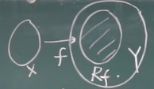
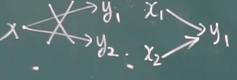
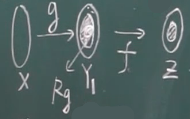

# 一、映射与函数

## 1.1.1 映射

X ，Y	非空集合

法则 f ，对 X 中的每个元素 x ，都有唯一的 y 与之对应

f 映射	f ：X (像) -> Y (原像)

X ：定义域	
$$
Df (Domain)
$$
​		值域	
$$
Rf (Range)\quad Rf \subset Y
$$
注： ①三要素：X ，f ，Rf

​		 ②
$$
x \in X\quad对应的y是唯一的\\
Rf \subset Y\quad Rf \neq Y
$$

---

满射：
$$
Rf = Y
$$
单射： 
$$
x_1 \neq x_2 \quad f(x_1) \neq f(x_2)
$$
一一映射：
$$
单射，满射
$$
逆映射：
$$
设f：X \rightarrow Y 单射\quad 对于每个y\in Rf, 有唯一的x\in X\\
f(x)=y\quad g:Rf \rightarrow X\quad f^-\quad Df^-=Rf\quad Rf^-=X
$$
复合映射：
$$
g：x \rightarrow Y_1 \quad f:Y_2 \rightarrow Z\\
Y_1 \subset Y_2 \quad x \in X \quad f[g(x)] \in Z\\
fog：X\rightarrow Z \quad Rg \subset Df
$$

## 1.1.2 函数